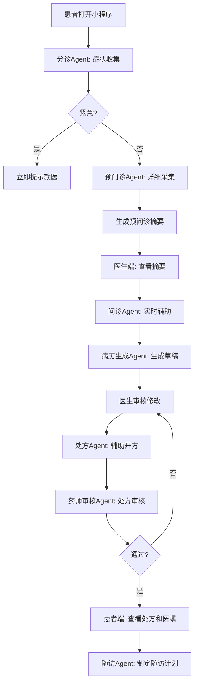
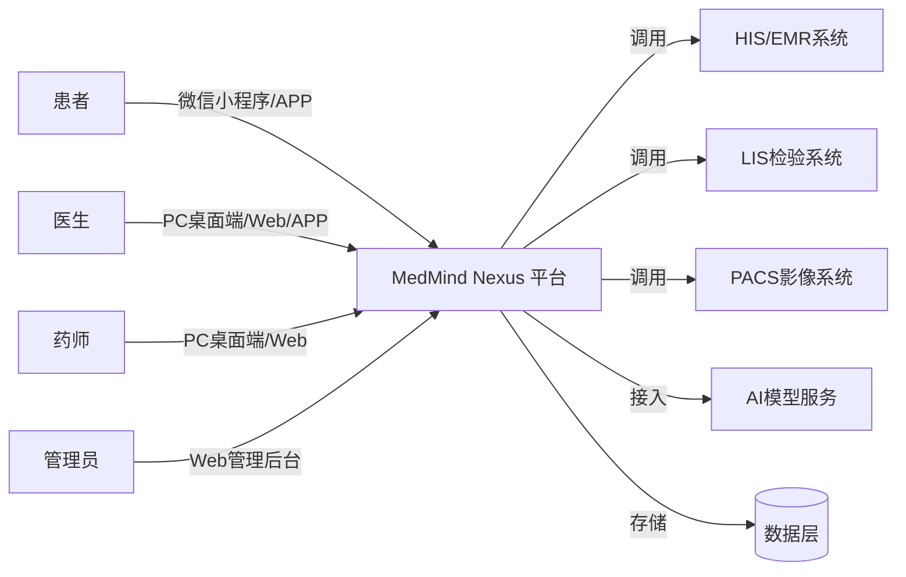
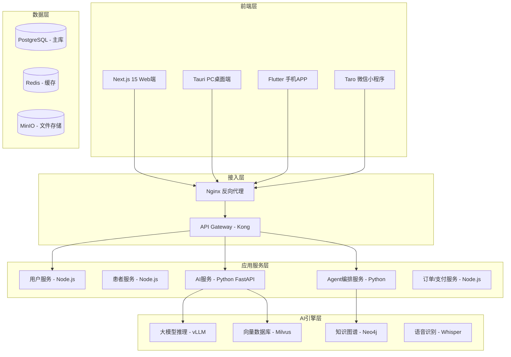
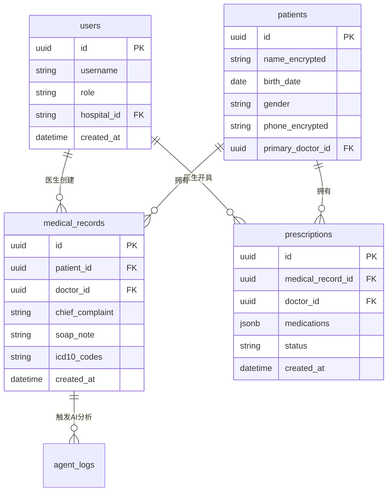

# MedMind Nexus 医智中枢
## 产品需求说明书（PRD）

**文档版本**：v1.0  
**编制日期**：2026年6月1日  
**编制人**：产品委员会  
**审批状态**：待审批  

---

# 项目概述

## 项目名称
**MedMind Nexus（医智中枢）**

## 一句话定位
面向中小医疗机构的AI原生智能体医疗平台，让每一家医院都能拥有AI诊疗能力。

## 电梯演讲（Elevator Pitch）
MedMind Nexus 是一个集PC桌面端、Web浏览器端、手机APP端、微信小程序端四位一体的医疗AI智能体平台。通过多Agent协作架构、RAG知识库增强、医疗大模型微调等前沿技术，为中小医院、诊所、药店、医生个人提供可拆可卖的模块化AI医疗解决方案。每个功能模块既可独立部署销售，也可组合成完整解决方案。

## 目标用户画像（Persona）

### Persona 1：张医生（三级医院主治医师）
- **年龄**：38岁
- **岗位**：心内科主治医师
- **痛点**：每天写病历2-3小时，科研压力大，需要追踪最新指南
- **使用场景**：诊间用语音转病历，科研用文献检索，随访用AI提醒
- **技术水平**：会用微信、企业微信，不熟悉AI工具

### Persona 2：李院长（民营医院院长）
- **年龄**：52岁
- **岗位**：二级民营医院院长
- **痛点**：招不到好医生，医疗质量难保证，医保控费压力大
- **使用场景**：用AI提升诊疗水平，用DRG控费系统，用智能导诊提升患者体验
- **技术水平**：会基础电脑操作，依赖信息科

### Persona 3：王药师（连锁药店店长）
- **年龄**：35岁
- **岗位**：连锁药店执业药师
- **痛点**：店员专业度不足，用药咨询耗时长，慢病客户流失
- **使用场景**：AI用药咨询，慢病管理，荐药助手
- **技术水平**：会用平板，熟悉药店管理系统

### Persona 4：赵教授（医学院博士生导师）
- **年龄**：55岁
- **岗位**：附属医院科研处处长
- **痛点**：国自然标书难中，论文发表压力大，学生科研训练不足
- **使用场景**：标书生成辅助，论文统计，学生教学
- **技术水平**：会用PubMed，熟悉统计软件

## 核心价值主张
**"模块化AI医疗智能体，可拆可卖，即插即用"**
- 对医院：低成本获得AI诊疗能力，无需自建团队
- 对医生：节省50%文书时间，获得AI第二诊疗意见
- 对患者：更准确的诊断，更便捷的就医体验
- 对开发者（你）：每个模块可独立交付，覆盖从5万到200万的不同价位订单

## 商业模式
1. **SaaS订阅**：基础版1980元/月/医院（限5医生），专业版按医生数计费
2. **定制开发**：单模块5-50万，全套50-200万
3. **私有化部署**：DeepSeek/通义等模型院内私有化，20-100万/次
4. **运维服务**：年费15-30%合同金额

## 关键成功指标（KPI/北极星指标）
- **北极星指标**：活跃医生数（每周至少使用3次AI功能的医生数）
- **次要指标**：
  - 病历生成准确率 > 95%
  - AI诊断建议采纳率 > 70%
  - 系统可用性 > 99.9%
  - 客户续约率 > 80%

---

# 第1章：市场与竞品分析

## 1.1 市场规模与增长率

| 市场层级 | 规模（2026） | CAGR | 说明 |
|---------|--------------|------|------|
| 全球医疗AI市场 | 507亿美元 | 38.6% | 高速增长期 |
| 中国医疗AI市场 | 220亿元人民币 | 30%+ | 政策驱动明显 |
| 中小医院AI渗透率 | < 5% | - | 巨大增量空间 |

**TAM/SAM/SOM分析**：
- **TAM（总可用市场）**：中国所有医疗机构约104万家
- **SAM（可服务市场）**：有信息化基础的中小医院/诊所约12万家
- **SOM（可获得市场）**：3年内目标覆盖1000家，市场占有率约1%

## 1.2 竞品矩阵分析

| 竞品 | 定位 | 核心功能 | 定价 | 技术栈 | 优势 | 劣势 |
|------|------|----------|------|--------|------|------|
| **医联MedGPT** | 互联网医院AI | 在线问诊、处方流转 | B2C会员制 | 自研大模型 | 品牌强、流量大 | 不面向医院私有化 |
| **平安好医生** | 医疗健康平台 | 问诊、健康管理、电商 | 会员+电商 | 平安自研AI | 生态完整 | B2C为主 |
| **京东健康** | 医药电商+服务 | 问诊、药品配送 | 平台佣金 | 供应链+AI | 供应链强 | 不卖软件 |
| **讯飞医疗** | 智慧医院解决方案 | 语音电子病历、AI辅诊 | 项目制定制 | 讯飞大模型 | 语音技术强 | 价格高 |
| **Hippocratic AI** | 医疗多Agent | 护理、随访、用药提醒 | B2B SaaS | 1000+ Agents | 多Agent领先 | 未进入中国 |
| **Abridge** | 临床转录 | 病历自动生成 | B2B SaaS | 环境AI | 转录准确率高 | 仅英文 |
| **Glass Health** | 诊断辅助 | 诊断建议、病历生成 | B2B SaaS | 诊断Agent | 医生认可度高 | 仅英文 |

## 1.3 差异化定位

**MedMind Nexus的3个核心差异化**：
1. **多端联动 + 多Agent协作**：PC/Web/APP/小程序四端数据互通，多Agent协同完成复杂医疗任务
2. **可拆可卖的模块化设计**：每个功能模块独立部署、独立定价，适应不同客户预算
3. **中文医疗场景深度优化**：基于中文医疗大模型（DeepSeek-R1 Medical、HuatuoGPT-o1），符合国内医疗流程和合规要求

## 1.4 SWOT分析

| 维度 | 内容 |
|------|------|
| **优势（Strengths）** | 技术栈前沿（Agent/MCP/RAG）、模块化可拆卖、多端覆盖、医疗AI全栈能力 |
| **劣势（Weaknesses）** | 品牌知名度低、无NMPA三类证、医院客户获取周期长 |
| **机会（Opportunities）** | 中小医院AI需求爆发、政策大力支持、接单市场缺乏专业医疗AI开发者 |
| **威胁（Threats）** | 大厂（讯飞/腾讯/阿里）下沉、NMPA合规要求趋严、医疗数据安全和隐私风险 |

---

# 第2章：业务需求

## 2.1 核心业务流程图

### 主线流程：患者就医全流程

```
[患者端]
挂号 → 预问诊（AI） → 到院签到 → 候诊 → 问诊（医生+AI协诊） 
→ 检查/检验（AI辅助解读） → 诊断 → 处方 → 缴费 → 取药 → 随访（AI）

[医生端]
查看预约 → 查看AI预问诊摘要 → 问诊（AI实时辅助） → AI生成病历草稿 
→ 审核修改 → 开具检查/处方 → AI质控检查 → 完成诊疗

[管理端]
HIS对接 → 排班管理 → 质控看板 → DRG分析 → 运营报表
```

## 2.2 角色权限矩阵（RACI矩阵）

| 功能模块 | 超级管理员 | 医院管理员 | 医生 | 护士/医助 | 药师 | 患者 | AI Agent |
|---------|-----------|-----------|------|----------|------|------|----------|
| 系统配置 | R/A | C | I | I | I | - | - |
| 医生管理 | R/A | R | - | - | - | - | - |
| 患者管理 | R/A | R | C | C | I | R（本人） | R（脱敏） |
| AI预问诊 | I | I | I | C | I | R | A |
| 诊间辅助 | I | I | R/A | C | I | - | A |
| 病历生成 | I | I | R/A | C | I | - | A |
| 处方审核 | I | I | R | I | R/A | - | C |
| 检查解读 | I | I | R/A | I | I | - | A |
| 随访管理 | I | C | R | R | I | - | A |
| 科研辅助 | I | I | R/A | I | I | - | A |

R=负责执行，A=批准，C=咨询，I=知情，-=无权限

---

# 第3章：功能性需求

## 3.1 功能模块树

```
MedMind Nexus 医智中枢
├── M1：患者端应用
│   ├── M1-1：AI智能预问诊
│   ├── M1-2：智能分诊导诊
│   ├── M1-3：检查报告AI解读
│   ├── M1-4：用药提醒与随访
│   └── M1-5：健康档案管理
├── M2：医生端应用
│   ├── M2-1：AI诊间助手（语音转病历）
│   ├── M2-2：AI诊断辅助建议
│   ├── M2-3：检查检验AI解读
│   ├── M2-4：AI病历质控
│   └── M2-5：处方审核与用药建议
├── M3：管理端应用
│   ├── M3-1：医院运营管理
│   ├── M3-2：DRG/DIP医保控费
│   └── M3-3：医疗质量质控看板
├── M4：科研端应用
│   ├── M4-1：文献检索与知识发现
│   ├── M4-2：科研数据统计与分析
│   └── M4-3：基金标书辅助撰写
└── M5：AI Agent引擎（后端）
    ├── M5-1：多Agent协作编排
    ├── M5-2：RAG知识库问答
    ├── M5-3：医疗大模型微调与服务
    └── M5-4：MCP工具调用协议
```

## 3.2 核心功能详细需求

### M1-1：AI智能预问诊

**用户故事**：
> 作为患者，我希望在挂号后、就诊前能通过AI助手描述我的症状，以便医生在接诊前就能了解我的情况，减少问诊时间。

**验收标准（Given-When-Then）**：
- **Given** 患者已完成挂号
- **When** 患者打开小程序/APP进入预问诊
- **Then** AI通过多轮对话收集症状、病史、用药史
- **And** 生成结构化预问诊摘要（SOAP格式）
- **And** 推送给接诊医生
- **And** 整个流程不超过5分钟

**优先级**：Must Have

**技术实现要点**：
- 使用LangGraph编排多轮对话Agent
- 症状实体抽取使用微调的NER模型
- 紧急症状（胸痛、呼吸困难等）实时预警

### M2-1：AI诊间助手（语音转病历）

**用户故事**：
> 作为医生，我希望在问诊时AI能实时将我和患者的对话转成电子病历草稿，以便我只需审核修改即可，节省50%文书时间。

**验收标准**：
- **Given** 医生开启诊间助手
- **When** 医生和患者正常对话
- **Then** AI实时语音转写（区分医生/患者角色）
- **And** 自动提取主诉、现病史、体格检查、初步诊断
- **And** 生成SOAP格式病历草稿
- **And** 医生可在PC/平板/手机任意端审核修改
- **And** 语音识别准确率 > 92%，医学术语准确率 > 88%

**优先级**：Must Have

**技术实现要点**：
- 使用Whisper-large-v3或国内等效中文医疗ASR模型
- 使用DeepSeek-R1 Medical或HuatuoGPT-o1生成病历
- 支持实时流式输出（< 3秒延迟）

### M5-1：多Agent协作编排

**用户故事**：
> 作为系统架构师，我希望能灵活编排多个AI Agent协作完成复杂医疗任务（如：分诊Agent → 问诊Agent → 检查解读Agent → 诊断Agent → 处方Agent），以便提供比单Agent更准确、更完整的服务。

**验收标准**：
- **Given** 系统配置了多Agent协作流程
- **When** 触发特定医疗场景（如"CompleteConsultation"）
- **Then** 多个Agent按预设顺序/条件依次执行
- **And** Agent间通过A2A协议传递结构化信息
- **And** 每个Agent的执行结果可审计、可回溯
- **And** 支持Human-in-the-loop（关键决策需医生确认）

**优先级**：Must Have

**技术实现要点**：
- 使用LangGraph实现Agent工作流编排
- 使用A2A协议实现Agent间通信
- 使用MCP协议实现Agent调用医疗工具（EHR查询、知识库检索等）

## 3.3 功能优先级（MoSCoW法）

| 优先级 | 功能模块 | 说明 |
|--------|----------|------|
| **Must Have** | M1-1预问诊、M2-1诊间助手、M2-4病历质控、M5-1多Agent编排、M5-2 RAG知识库 | 核心差异化功能，MVP必须有 |
| **Should Have** | M1-2分诊、M2-2诊断辅助、M2-5处方审核、M3-2 DRG控费 | 重要但不影响MVP上线 |
| **Could Have** | M1-3检查解读、M3-3质控看板、M4科研辅助 | 锦上添花功能，V2.0加入 |
| **Won't Have** | 医学影像AI诊断（需NMPA三类证） | 本期不做，规避合规风险 |

---

# 第4章：AI能力专项需求 ⭐

## 4.1 AI能力清单

| AI功能 | 类型 | 模型选型 | 部署方式 | 合规等级 |
|--------|------|----------|----------|----------|
| 智能预问诊 | 大模型对话 | DeepSeek-R1 Medical / HuatuoGPT-o1 | 云端API或私有化 | 低风险（非诊断） |
| 语音转病历 | ASR+NLP | Whisper-large-v3 + DeepSeek-R1 | 私有化部署 | 中风险（需质控） |
| 诊断辅助建议 | 大模型推理 | DeepSeek-R1 Medical（微调） | 私有化部署 | 中风险（医生建议，非最终诊断） |
| 病历质控 | NLP规则+NLP | 自研规则引擎 + LLM | 私有化部署 | 低风险（辅助质控） |
| 处方审核 | 知识图谱+规则 | Neo4j知识图谱 + 规则引擎 | 私有化部署 | 中风险（药师最终确认） |
| 医学知识库问答 | RAG | 向量数据库 + DeepSeek-R1 | 云端或私有化 | 低风险（参考信息） |
| 医学影像辅助 | CV模型 | MONAI + SAM-Med2D | 私有化部署 | **高风险（需NMPA证，本期不做）** |

## 4.2 模型选型方案

### 主模型：DeepSeek-R1 Medical（推荐）
- **理由**：67B参数，中文医疗场景优化，已部署超60家医院，Apache 2.0开源协议可商用
- **部署方式**：vLLM推理引擎，4 x A100 40GB（满血版）或2 x RTX 4090（量化版）
- **微调方案**：使用医院历史病历数据（脱敏后）进行LoRA微调

### 备选模型：HuatuoGPT-o1
- **理由**：7B-70B可选，复杂医学推理能力强，可验证推理链（Verify-in-Chain）
- **适用场景**：需要展示AI推理过程的场景（如诊断建议的"思维链"）

### 自训小模型方案：病历NER模型
- **任务**：从非结构化病历文本中提取疾病、症状、药物、检查等实体
- **模型**：BiLSTM-CRF 或 BERT-CRF
- **数据**：CMeEE医学实体抽取数据集（开源）+ 医院脱敏病历
- **预期F1值**：> 0.85

## 4.3 Prompt工程规范

### 预问诊Prompt模板
```
你是一位专业的医疗AI预问诊助手。
你的任务是通过多轮对话收集患者的症状、病史、用药史等信息。

【规则】
1. 每次只问1-2个问题，避免一次性问太多
2. 按照"主诉 → 现病史 → 既往史 → 用药史 → 过敏史"的顺序采集
3. 如果患者出现紧急症状（胸痛、呼吸困难、意识障碍等），立即提示"请立即就医"
4. 不要给出诊断结论，只做信息收集
5. 使用通俗易懂的语言，避免专业术语

【输出格式】
最后生成JSON结构化的预问诊摘要：
{
  "chief_complaint": "主诉",
  "history_present_illness": "现病史",
  "past_history": "既往史",
  "medication_history": "用药史",
  "allergy_history": "过敏史",
  "urgency_level": "紧急程度（低/中/高/紧急）"
}

开始对话，问候患者并引导其描述症状。
```

### 病历生成Prompt模板
```
你是一位专业的医疗AI助手，负责根据问诊对话生成电子病历。

【输入】
问诊对话记录：
{{conversation}}

患者基本信息：
{{patient_info}}

【任务】
生成符合以下格式的SOAP病历：

S（Subjective，主诉）：
[患者主诉的症状，引用患者原话]

O（Objective，客观检查）：
[体格检查结果，如果有输入的话]

A（Assessment，评估）：
[初步诊断，使用ICD-10编码格式]

P（Plan，计划）：
[检查建议、治疗建议、随访建议]

【要求】
1. 使用专业但简洁的医疗术语
2. 不添加未经对话确认的内容
3. 如果信息不足，在对应字段标注"[需补充]"
4. 初步诊断列出top 3鉴别诊断
```

## 4.4 RAG方案设计

### 知识库来源
1. **临床指南**：中华医学会各学科指南（心内、呼吸、消化等）
2. **专家共识**：各疾病诊疗共识
3. **药品说明书**：国家药品监督管理局批准的药品说明书
4. **医学教科书**：《内科学》《外科学》等经典教材
5. **医院SOP**：各科室标准操作流程

### 向量数据库选型
- **推荐**：Milvus（大规模、高性能）或 Qdrant（易用性好）
- **Embedding模型**：text-embedding-ada-002（OpenAI）或 bge-large-zh-v1.5（开源中文）

### Chunk策略
- **指南/共识**：按章节切分，每块500-800字，重叠100字
- **药品说明书**：每个药品独立存储，包含【适应症】【用法用量】【不良反应】【禁忌】等字段
- **教科书**：按疾病切分，每块300-500字

### Rerank策略
- 使用Cohere Rerank或bge-reranker-large进行重排序
- Top-K检索：召回Top 20，Rerank后取Top 5

## 4.5 Agent工作流设计

### 完整就诊流程的多Agent协作



### Agent间通信（A2A协议）
- **分诊Agent → 预问诊Agent**：传递 `{symptoms: [...], urgency: "中", initial_impression: "疑似咽炎"}`
- **预问诊Agent → 病历生成Agent**：传递结构化预问诊JSON
- **病历生成Agent → 处方Agent**：传递 `{diagnosis: "急性咽炎", allergies: ["青霉素"]}`

## 4.6 AI性能指标

| 指标 | 目标值 | 评测方法 |
|------|--------|----------|
| 预问诊信息完整度 | > 85% | 人工评估预问诊摘要与最终病历的覆盖率 |
| 病历生成准确率 | > 95% | 医生对AI生成病历的修改率 < 5% |
| 诊断建议Top-3准确率 | > 75% | 与最终诊断对比 |
| 处方审核召回率 | > 99% | 已知药物相互作用测试用例 |
| 语音识别准确率（医疗场景） | > 92% | 标准医疗语音测试集 |
| AI响应延迟（P95） | < 3秒 | 生产环境监控 |

## 4.7 幻觉控制策略

**医疗AI的幻觉是生死攸关的问题**。必须采取多层防护：

### 第一层：Prompt护栏
- 在System Prompt中明确禁止AI给出确定性诊断结论
- 要求AI在不确定时明确说"建议进一步检查"或"请咨询主治医师"

### 第二层：知识边界检查
- 使用RAG确保AI的回答基于权威知识库
- 如果向量检索的相似度得分 < 0.7，让AI回答"这个问题我不太确定"

### 第三层：输出过滤
- 使用规则引擎检测AI输出中的禁忌症、相互作用等高风险内容
- 检测到高风险内容时，强制插入医生审核环节

### 第四层：Human-in-the-loop
- 所有AI生成的诊断建议、处方建议，必须经医生/药师确认后才能生效
- 系统记录AI建议与最终决策的差异，用于复盘和改进

## 4.8 人机协同流程

```
AI建议 → 医生审核 → 医生修改（可选） → 最终决策 → 记录溯源
```

- **AI角色**：辅助、建议、草稿生成
- **医生角色**：最终决策、签字负责
- **系统设计原则**：AI永远是"副驾驶"，医生永远是"主驾驶"

---

# 第5章：非功能性需求

## 5.1 性能需求

| 指标 | 要求 | 测试方法 |
|------|------|----------|
| 并发用户数 | 支持1000医生同时在线 | 压力测试 |
| AI接口响应时间（P95） | < 3秒 | 生产监控 |
| 普通API响应时间（P95） | < 200ms | 接口监控 |
| 数据库查询响应时间（P95） | < 100ms | 慢查询监控 |
| 系统吞吐量 | 支持10万次AI调用/天 | 容量规划 |

## 5.2 可用性需求
- **系统可用性**：99.9%（即每月 downtime < 43分钟）
- **数据备份**：每日全量备份 + 实时增量备份
- **灾难恢复**：RTO < 4小时，RPO < 1小时

## 5.3 可扩展性需求
- **水平扩展**：AI推理服务支持动态扩容（K8s HPA）
- **存储扩展**：患者数据按医院分库分表，支持平滑扩容
- **3年用户增长预期**：从1000用户增长到100万用户，系统无需重构

## 5.4 可维护性需求
- **代码规范**：遵循ESLint + Prettier（前端），PEP8（Python）
- **单测覆盖率**：核心业务逻辑 > 80%
- **文档要求**：每个API、每个Agent、每个工具调用都有文档
- **日志规范**：结构化日志（JSON格式），包含trace_id用于全链路追踪

## 5.5 适老化需求（对老年患者尤其重要）
- **字体**：支持动态调整字体大小（最大支持24px）
- **对比度**：文字与背景对比度 ≥ 4.5:1（WCAG 2.1 AA标准）
- **操作简化**：关键操作（如挂号、查报告）不超过3次点击
- **语音辅助**：关键页面支持语音播报

---

# 第6章：合规与安全需求 ⭐

## 6.1 国内合规要求

### 6.1.1 必须遵守的法律法规
| 法规名称 | 关键要求 | 系统应对措施 |
|---------|---------|-------------|
| 《数据安全法》 | 医疗数据分类分级、重要数据出境安全评估 | 数据分级标签、数据本地化存储 |
| 《个人信息保护法》 | 患者知情同意、敏感个人信息（健康信息）需单独同意 | 知情同意书电子化、患者数据加密存储 |
| 《互联网诊疗管理办法》 | AI不得开具处方、不得替代医师诊断 | 系统设计确保处方必须由医生开具、AI建议需医生确认 |
| 《人工智能医疗器械注册技术审查指导原则》 | 如果做诊断AI，需NMPA审批 | 本期不做诊断AI，规避此要求 |
| 等保2.0（三级） | 访问控制、审计日志、入侵检测、数据备份 | 完整等保三级合规方案（见下） |

### 6.1.2 等保三级技术要求
- **访问控制**：基于RBAC的细粒度权限控制，支持多因素认证（MFA）
- **审计日志**：所有操作（登录、数据访问、AI决策）不可篡改的审计日志，保留3年
- **数据加密**：传输层TLS 1.3，存储层AES-256加密
- **入侵检测**：部署IDS/IPS，异常行为实时告警

## 6.2 数据脱敏方案

### 患者PII/PHI字段清单
| 字段 | 类型 | 脱敏算法 |
|------|------|----------|
| 姓名 | PII | 替换（用"患者A""患者B"代替）或保留姓氏用"*"替代名字 |
| 身份证号 | PII | 保留前6位（地区）和后4位，中间用"*"替代 |
| 手机号 | PII | 保留前3位和后4位，中间用"*"替代 |
| 人脸照片 | 生物识别信息 | 禁止上传到云端，本地化处理 |
| 病历文本 | PHI | 使用NER模型识别并脱敏（替换为人名用"患者"，医院名用"我院"） |
| 诊断信息 | PHI | 可以保留（用于AI训练时需去标识化） |

### 脱敏处理流程
```
原始数据 → NER实体识别 → 替换/掩码 → 脱敏后数据 → AI训练/推理
                                                              ↓
                                                        原始数据加密存储（仅授权人员可解密）
```

## 6.3 审计日志设计

所有以下操作必须记录审计日志：
- 用户登录（成功/失败，IP地址，设备信息）
- 患者数据访问（谁、什么时候、查看了哪个患者的哪些数据）
- AI决策记录（哪个Agent、基于什么输入、给出了什么建议、医生是否采纳）
- 数据导出（谁、什么时候、导出了什么数据、导出到哪里）
- 系统配置变更（谁、什么时候、修改了什么配置、修改前/后的值）

审计日志不可被任何用户（包括超级管理员）删除或篡改。

## 6.4 如果未来做出海（国际合规预备）

| 法规 | 地区 | 关键要求 |
|------|------|----------|
| HIPAA | 美国 | 患者健康信息（PHI）保护，BAA协议 |
| GDPR | 欧盟 | 数据主体权利（访问权、被遗忘权），数据本地化 |
| FDA SaMD | 美国 | 软件作为医疗器械的审批 |

---

# 第7章：技术架构与技术选型

## 7.1 整体架构图（C4模型 - Context层）



## 7.2 容器层架构（Container层）



## 7.3 四端技术栈选型与理由

### PC桌面端：Tauri v2
- **理由**：
  - 安装包体积仅5-10MB（Electron约150MB）
  - 内存占用低（Rust后端）
  - 安全性高（Rust的内存安全保证）
  - 2026年已非常成熟
- **前端框架**：React 19 + TypeScript + Tailwind CSS
- **后端（Tauri后端）**：Rust（处理本地文件、数据库加密存储等）

### Web端：Next.js 15（App Router）
- **理由**：
  - React生态最成熟的全栈框架
  - App Router + Server Components 性能优秀
  - 内置API Routes，减少前后端分离复杂度
  - Vercel AI SDK原生支持（方便接入各种LLM）
- **UI组件库**：shadcn/ui（可定制性强，适合医疗专业UI）

### 手机APP：Flutter 3.x
- **理由**：
  - 一套代码跑iOS和Android，开发效率高
  - 自绘引擎，UI一致性高
  - 性能接近原生（60fps）
  - 医疗APP不需要极致性能，Flutter足够
- **状态管理**：Riverpod
- **网络层**：Dio（支持拦截器、重试、缓存）

### 微信小程序：Taro 4（React语法）
- **理由**：
  - React语法，与Web端代码复用率高
  - 编译到微信/支付宝/抖音多端
  - 如果未来需要扩展到其他小程序平台，成本低
- **状态管理**：Zustand（轻量）

## 7.4 AI工程层技术选型

| 组件 | 选型 | 理由 |
|------|------|------|
| Agent编排框架 | LangGraph | 确定性执行（适合医疗）、状态管理强大、可可视化工作流 |
| RAG框架 | LlamaIndex | 医疗RAG场景优化好、支持多种向量库 |
| 大模型推理引擎 | vLLM | 高吞吐、PagedAttention内存优化、支持连续批处理 |
| 向量数据库 | Milvus | 大规模、支持GPU加速、企业级特性全 |
| 知识图谱 | Neo4j | 图查询语言Cypher易用、医疗知识图谱案例多 |
| 语音识别 | Whisper-large-v3（开源）或 讯飞医疗ASR（商用） | Whisper开源免费，讯飞中文医疗场景准确率更高 |
| 语音合成（TTS） | Edge TTS（免费）或 讯飞TTS（商用） | 用于AI随访问候语音播放 |

## 7.5 数据层设计

### 核心数据表（ER图用Mermaid见下一章）

**主要实体**：
- `users`（用户表：医生、患者、药师等）
- `patients`（患者档案表）
- `medical_records`（病历表）
- `prescriptions`（处方表）
- `agents`（Agent配置表）
- `agent_logs`（Agent执行日志表）
- `knowledge_base`（知识库文档表）
- `vector_embeddings`（向量嵌入表）

### 数据归档策略
- 病历数据：热数据（最近1年）存PostgreSQL，冷数据（1年以上）归档到对象存储（MinIO）
- 向量数据：Milvus支持自动归档

---

# 第8章：数据模型与接口设计

## 8.1 核心ER图（Mermaid）



## 8.2 核心API设计（OpenAPI 3.0片段）

### 预问诊API
```yaml
/post/v1/patients/{patient_id}/pre_consultation:
  post:
    summary: 启动AI预问诊
    tags: [Patient]
    parameters:
      - name: patient_id
        in: path
        required: true
        schema:
          type: string
          format: uuid
    requestBody:
      required: true
      content:
        application/json:
          schema:
            type: object
            properties:
              chief_complaint:
                type: string
                description: 患者主诉
    responses:
      200:
        description: 预问诊会话创建成功
        content:
          application/json:
            schema:
              type: object
              properties:
                session_id:
                  type: string
                  format: uuid
                first_question:
                  type: string
      401:
        $ref: '#/components/responses/Unauthorized'
```

### 病历生成API
```yaml
/post/v1/ai/consultation/{session_id}/generate_note:
  post:
    summary: AI生成病历草稿
    tags: [AI]
    parameters:
      - name: session_id
        in: path
        required: true
        schema:
          type: string
          format: uuid
    responses:
      200:
        description: 病历草稿生成成功
        content:
          application/json:
            schema:
              type: object
              properties:
                note_id:
                  type: string
                  format: uuid
                soap_note:
                  type: object
                  properties:
                    subjective:
                      type: string
                    objective:
                      type: string
                    assessment:
                      type: string
                    plan:
                      type: string
                confidence_score:
                  type: number
                  format: float
                  description: AI置信度 0-1
      202:
        description: 正在生成中，请轮询
```

## 8.3 第三方接口对接规范

### HIS系统对接（HL7 FHIR标准）
- **患者信息同步**：FHIR Patient Resource
- **就诊记录**：FHIR Encounter Resource
- **诊断信息**：FHIR Condition Resource
- **如果HIS不支持FHIR**：提供RESTful API适配层

### 医保接口对接
- 遵循国家医保局《医保接口规范》
- 实时医保预结算接口
- DRG分组查询接口

---

# 第9章：UI/UX设计要求

## 9.1 设计原则

1. **专业感 + 信任感**：医疗产品必须让用户（尤其是患者）感到可信
   - 配色：主色调用蓝色系（#0066CC，代表专业、信任），辅助色调用绿色（#00AA55，代表健康）
   - 避免过于花哨的动画和配色

2. **老年友好（适老化）**：
   - 字体最小16px，支持动态放大到24px
   - 按钮最小44x44pt（手指点击区域）
   - 关键操作不超过3次点击

3. **医生工作流优先**：
   - 诊间助手以"少点击、快输入"为核心
   - 支持快捷键、语音输入等多种输入方式

## 9.2 信息架构（IA）

### 医生端APP/PC端
```
首页（今日预约、待诊患者）
├── 诊间助手（语音转写、AI建议）
├── 病历管理（新建、查询、质控）
├── 处方管理（开具、审核、查询）
├── 检查解读（查看报告、AI解读）
├── 随访管理（计划、执行、记录）
└── 个人中心（设置、帮助）
```

### 患者端小程序/APP
```
首页（我的医生、健康档案）
├── AI预问诊
├── 挂号预约
├── 检查报告（查看、AI解读）
├── 用药提醒
├── 随访记录
└── 个人中心
```

## 9.3 关键页面线框描述

### 诊间助手页面（医生PC端核心页面）
```
┌────────────────────────────────────┐
│  患者：张三  预约时间：09:30        │
├────────────────────────────────────┤
│ [AI预问诊摘要]                     │
│ 主诉：反复胸闷2周                  │
│ 初步判断：疑似冠心病               │
│ [查看详情]                         │
├─────────────────┬──────────────────┤
│ [对话区]        │ [AI实时辅助区]    │
│ 医生：您好，...  │ 🤖 可能的诊断：  │
│ 患者：嗯，...    │ 1. 冠心病        │
│                  │ 2. 胃食管反流    │
│ [🎤 录音中...]  │ [查看指南]        │
├─────────────────┴──────────────────┤
│ [生成病历草稿]  [AI质控检查]        │
│ 病历内容编辑区...                   │
│                                     │
│ [保存病历]  [开具处方]  [预约检查] │
└────────────────────────────────────┘
```

---

# 第10章：里程碑与交付计划

## 10.1 四阶段路线图

### MVP阶段（第1-3个月）：核心诊疗流程跑通
**目标**：医生能真正用AI助手完成一次完整问诊并生成病历

| 迭代 | 周期 | 核心交付物 | 学习重点 |
|------|------|-----------|----------|
| Sprint 1 | 2周 | 项目脚手架、用户系统、患者档案 | Tauri/Next.js/Flutter多端开发 |
| Sprint 2 | 2周 | 预问诊Agent（单Agent）、小程序端 | LangChain/LangGraph基础 |
| Sprint 3 | 2周 | 诊间助手（语音转写+病历生成） | Whisper ASR、DeepSeek API调用 |
| Sprint 4 | 2周 | 病历质控Agent、RAG知识库 | RAG原理、向量数据库 |
| Sprint 5 | 2周 | 多Agent协作编排（LangGraph） | 多Agent架构设计 |
| Sprint 6 | 2周 | MVP整合测试、医生内测 | 全链路调试、产品打磨 |

**MVP交付物清单**：
- ✅ PC桌面端（Tauri）：诊间助手核心功能
- ✅ 微信小程序：AI预问诊
- ✅ 后端API服务
- ✅ AI Agent引擎（预问诊、病历生成、质控3个Agent）
- ✅ 基础RAG知识库（内科学指南）

### Beta阶段（第4-5个月）：功能完善 + 真实医生试用
**目标**：邀请10-20位医生真实使用，收集反馈迭代

新增功能：
- 处方审核Agent
- 检查报告AI解读
- DRG控费分析（基础版）
- 适老化改造

### V1.0阶段（第6-8个月）：商业化准备
**目标**：达到可销售状态，完成等保三级合规

新增功能：
- 多医院多租户架构
- HIS/LIS/PACS系统对接
- 等保三级合规改造
- 私有化部署方案（Docker Compose一键部署）

### V2.0阶段（第9-12个月）：Agent生态 + 科研模块
**目标**：成为医疗AI Agent平台，支持第三方Agent接入

新增功能：
- Agent Marketplace（第三方Agent上架）
- 科研辅助模块（文献检索、统计、标书）
- MCP协议全面支持（让第三方工具接入）
- A2A协议支持（多医院Agent协作）

## 10.2 学习路线图（针对你作为练手项目）

| 模块 | 可以学到的技术点 | 对应市场订单类型 | 市场单价区间 |
|------|----------------|----------------|------------|
| MVP-预问诊 | LangGraph基础、Prompt工程 | AI问诊小程序开发 | 3-10万 |
| MVP-诊间助手 | ASR集成、LLM API调用、流式输出 | 医生Copilot定制开发 | 5-20万 |
| MVP-RAG知识库 | 向量数据库、Embedding、Rerank | 企业知识库问答系统 | 3-15万 |
| MVP-多Agent | LangGraph高级、Agent编排 | 复杂AI工作流开发 | 10-50万 |
| Beta-处方审核 | 知识图谱（Neo4j）、规则引擎 | 药店/医院用药审核系统 | 5-30万 |
| Beta-DRG控费 | 数据分析、医保规则 | 医院精细化管理软件 | 10-50万 |
| V1.0-私有化部署 | Docker、K8s、模型量化 | 医院DeepSeek私有化 | 10-100万 |
| V2.0-Agent Marketplace | MCP/A2A协议、多租户架构 | AI Agent平台开发 | 50-200万 |

---

# 第11章：测试方案

## 11.1 测试策略

| 测试类型 | 工具 | 覆盖率要求 |
|---------|------|-----------|
| 单元测试 | Jest（前端）、Pytest（后端） | 核心逻辑 > 80% |
| 集成测试 | Supertest（API）、Testcontainers（依赖） | 所有API端点 |
| E2E测试 | Playwright（Web）、Appium（APP） | 核心业务流程 |
| 性能测试 | k6 或 JMeter | 支持1000并发 |
| 安全测试 | OWASP ZAP | 等保三级合规 |
| AI模型评测 | 医学专业基准（MedQA、CMB） | Top-1准确率 > 60%，Top-3 > 75% |

## 11.2 AI模型评测方案

### 测试用例集构建
- **诊断准确性测试**：500个真实脱敏病历（覆盖内、外、妇、儿、急诊）
- **病历生成质量测试**：100个问诊录音，由3位主治医师独立评分（1-5分）
- **处方审核召回率测试**：已知药物相互作用数据集（DDInter、DrugBank）

### A/B测试方案
- 新AI模型/新Prompt上线前，先对10%流量进行测试
- 核心指标：医生采纳率、修改率、患者满意度
- 如果新版本核心指标下降 > 5%，自动回滚

## 11.3 医学专家评审

**这是医疗AI产品特有的测试环节**。

- 每个AI功能上线前，必须由至少3位相关专科主治医师进行评审
- 评审内容：AI建议的医学准确性、是否符合临床指南、是否存在误导性内容
- 评审不通过的功能严禁上线

---

# 第12章：风险与应急预案

## 12.1 技术风险

| 风险 | 概率 | 影响 | 应对措施 |
|------|------|------|----------|
| AI幻觉导致错误建议 | 中 | 高（医疗事故风险） | 多层幻觉控制（见第4.7节）、Human-in-the-loop、医疗责任险 |
| 模型推理延迟过高 | 中 | 中 | vLLM推理优化、模型量化、缓存策略 |
| 数据泄露 | 低 | 极高 | 加密存储、访问控制、等保三级 |
| HIS对接失败 | 高 | 中 | 提供标准FHIR接口、同时支持定制对接 |

## 12.2 合规风险

| 风险 | 概率 | 影响 | 应对措施 |
|------|------|------|----------|
| 被认定为"诊断AI"需NMPA证 | 中 | 高 | 明确产品定位为"辅助"，不做诊断结论；所有AI输出标注"仅供参考，请以医生诊断为准" |
| 患者数据泄露被处罚 | 低 | 极高 | 等保三级、数据脱敏、签署DPA |
| 《互联网诊疗管理办法》政策变化 | 低 | 中 | 保持与卫健委沟通、产品设计预留合规调整空间 |

## 12.3 业务风险

| 风险 | 概率 | 影响 | 应对措施 |
|------|------|------|----------|
| 医生不愿用（习惯阻力） | 高 | 高 | 产品设计以"节省时间"为核心价值，而非"替代医生"；提供培训 |
| 医院采购周期长 | 高 | 中 | 同时做医生个人版（SaaS订阅，无需医院采购流程） |
| 大厂竞争 | 中 | 高 | 聚焦中小医院（大厂看不上的市场）、模块化可拆卖（灵活） |

## 12.4 应急回滚方案

- **AI模型回滚**：保留最近3个版本的模型，发现问题时5分钟内切换
- **系统回滚**：Blue-Green部署，发现问题立即切换到上一版本
- **数据恢复**：每日全量备份 + 实时增量，RPO < 1小时

---

# 附录A：项目词汇表（Glossary）

| 术语 | 英文 | 说明 |
|------|------|------|
| 主诉 | Chief Complaint | 患者就诊时的主要症状 |
| SOAP | Subjective, Objective, Assessment, Plan | 病历格式标准 |
| RAG | Retrieval-Augmented Generation | 检索增强生成 |
| Agent | - | AI智能体，能使用工具、做规划、执行任务 |
| MCP | Model Context Protocol | Anthropic主导的AI工具调用标准协议 |
| A2A | Agent-to-Agent Protocol | Google主导的Agent间通信协议 |
| NER | Named Entity Recognition | 命名实体识别 |
| HL7 FHIR | - | 医疗数据交换国际标准 |
| DRG | Diagnosis-Related Groups | 疾病诊断相关分组（医保支付） |
| SaaS | Software as a Service | 软件即服务（订阅制） |
| vLLM | - | 高性能大模型推理引擎 |
| LoRA | Low-Rank Adaptation | 大模型高效微调方法 |
| NMPA | National Medical Products Administration | 中国国家药品监督管理局 |
| HIPAA | Health Insurance Portability and Accountability Act | 美国医疗隐私法规 |

---

**文档结束**

> 💡 **学习价值**：这份PRD覆盖了医疗AI全栈项目的完整需求。作为练手项目，你能学到：多端开发（Tauri/Next.js/Flutter/Taro）、AI工程（LangGraph/RAG/vLLM/向量数据库）、医疗业务（HIS对接/DRG/病历质控）、合规安全（等保/NMPA/数据脱敏）。每个模块都可以拆出来独立交付给真实客户。
