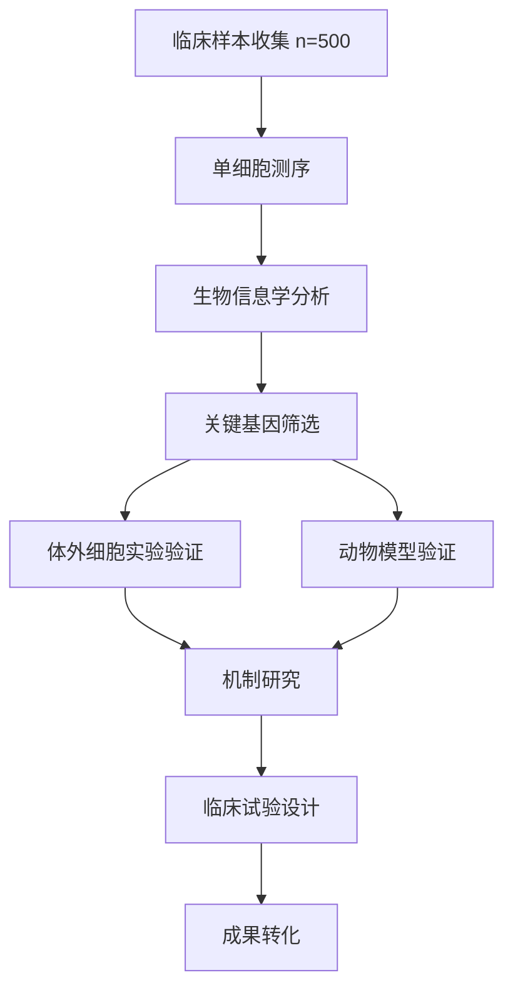

# M4：科研端应用详细设计

## 1. 模块概述

科研端面向**医生、研究生、科研处长、医学院师生**，提供AI辅助的文献检索、数据统计、论文写作、基金标书撰写等功能。**核心价值：让医生从繁琐的科研工作中解放出来，提升科研产出效率**。

支持载体：Web浏览器端（Next.js 15）为主，PC桌面端（Tauri）为辅。

## 2. 功能架构

```
科研端应用
├── 文献检索与知识发现
│   ├── PubMed/知网智能检索
│   ├── 文献AI摘要与总结
│   ├── 研究趋势分析
│   └── 文献推荐（基于研究兴趣）
├── 科研数据统计与分析
│   ├── 临床研究数据管理
│   ├── 统计学分析（R/Python集成）
│   ├── 图表自动生成
│   └── 数据可视化
├── 基金标书辅助撰写
│   ├── 标书智能生成（NSFC/国自然）
│   ├── 研究基础梳理
│   ├── 技术路线图生成
│   └── 标书查重与质量评估
├── 论文写作辅助
│   ├── 论文框架生成
│   ├── 语言润色（中→英）
│   ├── 图表生成与美化
│   └── 选刊推荐
└── 科研项目管理
    ├── 项目进度跟踪
    ├── 伦理审查管理
    ├── 多中心研究协作
    └── 科研成果统计
```

## 3. 核心功能详细设计

### 3.1 文献检索与知识发现（核心功能）

#### 3.1.1 功能描述
AI驱动的文献检索与知识发现系统，帮助医生快速找到相关研究、总结核心发现、发现研究趋势。

#### 3.1.2 技术架构

**数据源**：
- **PubMed**（英文医学文献）：使用Biopython的Entrez API
- **知网/万方**（中文医学文献）：使用爬虫或官方API（需授权）
- **Cochrane Library**（系统评价）：使用API
- **arXiv/q-bio**（预印本）：使用API

**AI处理流程**：
```
用户提问 → 查询改写（LLM） → 多库并行检索 
→ 结果去重/排序 → AI摘要生成 → 知识图谱构建 
→ 趋势分析 → 个性化推荐
```

#### 3.1.3 查询改写Prompt

```
你是一位医学文献检索专家。

【用户输入】
{{user_query}}

【任务】
将用户的问题改写成适合PubMed/知网检索的查询式（Query）。

要求：
1. 提取核心医学术语（使用MeSH词）
2. 考虑同义词、缩写
3. 生成3个查询式（从宽到严）

【输出格式】
{
  "original_query": "冠心病的最新治疗进展",
  "mesh_terms": ["Coronary Disease", "Therapeutics"],
  "queries": [
    "Coronary Disease/therapy AND (2022:2026[pdat])",
    "Coronary Artery Disease AND treatment AND recent",
    "冠心病 AND 治疗 AND (2022-2026)"
  ]
}
```

#### 3.1.4 文献摘要生成Prompt

```
你是一位医学研究者。

【任务】
对以下文献列表进行总结，提取：
1. 研究热点（出现频率最高的关键词）
2. 主要发现（每篇的核心结论）
3. 争议点（不同研究的矛盾结论）
4. 研究缺口（未来方向）

【文献列表】
{{papers_list}}

【输出格式】
## 文献总结

### 研究热点
- 免疫检查点抑制剂在冠心病中的应用（12篇）
- ...

### 主要发现
1. [第一篇文章]：...
2. ...

### 争议点
- 关于XXX，研究A认为...，但研究B认为...

### 研究缺口
- 缺乏大规模RCT研究
- ...
```

#### 3.1.5 前端交互设计

**页面1：文献检索页**
```
┌────────────────────────────────────────┐
│  📚 智能文献检索               [高级] │
├────────────────────────────────────────┤
│  搜索框：                              │
│  ┌──────────────────────────────────┐│
│  │ 冠心病 免疫治疗 最新进展          ││
│  └──────────────────────────────────┘│
│  筛选条件：                            │
│  ☑ 近5年   ☑ 英文   ☑ 中文        │
│  数据库：☑ PubMed ☑ 知网 ☑ Cochrance│
│                                        │
│  🤖 AI查询优化：[使用] [修改]        │
│  PubMed查询式：Coronary Disease...   │
│                                        │
│  [搜索]                                │
│                                        │
│  📊 检索结果：找到1,253篇            │
│  ──────────────────────────────────   │
│  [1] Immunotherapy in CAD: ... 2024  │
│     期刊：NEJM  影响因子：176.1       │
│     🤖 AI摘要：该研究探讨了...       │
│     [查看全文] [保存到我的文库]       │
│                                        │
│  [2] ...                               │
│                                        │
│  📈 研究趋势图（可交互）             │
│  [折线图：2019-2026年发表数量]      │
└────────────────────────────────────────┘
```

**页面2：文献详情页**
```
┌────────────────────────────────────────┐
│  ← 返回  文献详情                      │
├────────────────────────────────────────┤
│  ## 标题（英文/中文）                 │
│                                        │
│  **作者**：Zhang S, Li H, ...          │
│  **期刊**：New England Journal ...      │
│  **发表时间**：2024-03-15              │
│  **DOI**：10.xxxx/nejm20240315         │
│                                        │
│  ### 🤖 AI摘要                        │
│  本研究是一项多中心随机对照试验...    │
│  主要发现：免疫检查点抑制剂...         │
│  临床意义：为冠心病治疗提供了新的...   │
│                                        │
│  ### 📊 研究方法                     │
│  - 研究设计：RCT                      │
│  - 样本量：1,205例                   │
│  - 主要终点：MACE事件                 │
│                                        │
│  ### 🔗 相关文献（AI推荐）           │
│  [1] ...                              │
│                                        │
│  [📥 下载PDF] [📋 引用] [⭐ 收藏]   │
└────────────────────────────────────────┘
```

### 3.2 基金标书辅助撰写（高价值功能）

#### 3.2.1 功能描述
AI辅助撰写国家自然科学基金（NSFC）标书，包括：研究背景、研究内容、技术路线、创新点、研究基础等章节。

#### 3.2.2 标书生成Prompt

```
你是一位国家自然科学基金（NSFC）标书撰写专家。

【任务】
根据用户提供的初步想法，生成完整的标书初稿。

【用户提供的想法】
{{user_idea}}

【标书结构】
1. 摘要（400字以内）
2. 研究背景与意义
3. 国内外研究现状
4. 研究内容与研究目标
5. 研究方案与技术路线
6. 创新点
7. 年度计划与预期成果
8. 研究基础与条件

【要求】
1. 语言专业、严谨，符合NSFC标书规范
2. 创新点明确（至少3个）
3. 技术路线图用Mermaid格式生成
4. 参考文献引用格式规范

【输出格式】
Markdown格式，可直接复制到NSFC系统。
```

#### 3.2.3 技术路线图生成（Mermaid）

**示例输出**：


#### 3.2.4 标书质量评估

**评估维度**：
| 维度 | 评分标准 | 权重 |
|------|---------|------|
| 创新性 | 是否有明显创新点 | 30% |
| 科学性 | 研究设计是否合理 | 25% |
| 可行性 | 研究基础是否扎实 | 20% |
| 写作质量 | 语言是否规范、逻辑是否清晰 | 15% |
| 格式规范 | 是否符合NSFC格式要求 | 10% |

**AI评估Prompt**：
```
你是一位NSFC标书评审专家。

【任务】
对以下标书进行评分，并给出修改建议。

【评分维度】
1. 创新性（0-10分）
2. 科学性（0-10分）
3. 可行性（0-10分）
4. 写作质量（0-10分）
5. 格式规范（0-10分）

【标书内容】
{{proposal_content}}

【输出格式】
{
  "scores": {...},
  "overall_score": 7.5,
  "strengths": ["...", "..."],
  "weaknesses": ["...", "..."],
  "suggestions": ["...", "..."]
}
```

#### 3.2.5 前端交互设计（标书撰写页）

```
┌────────────────────────────────────────┐
│  📝 基金标书撰写          NSFC 2026 │
├────────────────────────────────────────┤
│  标书标题：                            │
│  ┌──────────────────────────────────┐ │
│  │ 基于单细胞测序的冠心病...        │ │
│  └──────────────────────────────────┘ │
│                                        │
│  🤖 AI辅助：                          │
│  [生成摘要] [生成研究背景] ...        │
│                                        │
│  标书内容编辑区：                      │
│  ──────────────────────────────────   │
│  ## 摘要                              │
│  （AI生成的内容，可编辑）              │
│                                        │
│  ## 研究背景与意义                    │
│  ...                                   │
│                                        │
│  [💾 保存] [🤖 AI评估质量] [📤 提交]│
│                                        │
│  📊 标书质量评分：7.5/10             │
│  - 创新性：8/10 ✅                    │
│  - 科学性：7/10 ⚠️                   │
│  - ...                                 │
│  [查看修改建议]                        │
└────────────────────────────────────────┘
```

### 3.3 科研数据统计与分析

#### 3.3.1 功能描述
提供临床研究数据管理、统计学分析、图表自动生成等功能，降低医生做科研的统计门槛。

#### 3.3.2 技术架构

**数据分析引擎**：
- **R**：通过`rpy2`（Python调用R）或RStudio Server
- **Python**：Pandas、NumPy、SciPy、Statsmodels
- **SPSS**：如果需要，可以对接SPSS Statistics（需授权）

**分析流程**：
```
上传数据（Excel/CSV/SPSS） → 数据清洗（AI辅助） 
→ 选择统计方法（AI推荐） → 执行分析 → 自动生成图表 
→ 生成统计报告
```

#### 3.3.3 统计方法推荐AI

**Prompt**：
```
你是一位医学统计学专家。

【数据特征】
- 样本量：120例
- 组别：2组（治疗组 vs 对照组）
- 结局变量：连续变量（血压变化值）
- 数据分布：正态分布（Shapiro-Wilk检验 P=0.32）

【任务】
推荐合适的统计方法，并给出R/Python代码。

【输出格式】
{
  "recommended_method": "独立样本t检验",
  "reason": "两组独立样本，连续变量，正态分布",
  "r_code": "t.test(bp_change ~ group, data = mydata)",
  "python_code": "scipy.stats.ttest_ind(group1, group2)",
  "effect_size": "Cohen's d = 0.65（中等效应）",
  "report_text": "独立样本t检验显示，治疗组与对照组..."
}
```

#### 3.3.4 前端交互设计（数据分析页）

```
┌────────────────────────────────────────┐
│  📊 科研数据分析                       │
├────────────────────────────────────────┤
│  [上传数据]  支持格式：Excel/CSV/SPSS │
│                                        │
│  📋 数据预览（前10行）：              │
│  | 病例号 | 年龄 | 性别 | 治疗...|  │
│  | 001    | 65   | 男   | 治疗...|  │
│  ...                                   │
│                                        │
│  🤖 AI数据分析建议：                  │
│  检测到2组独立样本，建议：            │
│  - 基线比较：卡方检验/ t检验          │
│  - 主要终点：Cox回归                  │
│  [一键执行分析]                        │
│                                        │
│  📈 分析结果：                        │
│  ──────────────────────────────────   │
│  ### 基线特征比较                      │
│  [表格：年龄、性别、合并症的P值]      │
│                                        │
│  ### 主要终点分析                      │
│  [Kaplan-Meier曲线图]                 │
│  HR: 0.72 (95% CI: 0.58-0.89)      │
│  P=0.003                               │
│                                        │
│  [📥 下载完整报告] [📤 导出图表]     │
└────────────────────────────────────────┘
```

## 4. 数据模型（科研端相关表）

### 4.1 `research_projects`（科研项目表）
```sql
CREATE TABLE research_projects (
    id UUID PRIMARY KEY DEFAULT gen_random_uuid(),
    title VARCHAR(200),
    project_type VARCHAR(50),  -- 'nsfc', 'clinical_trial', 'observational'
    pi_id UUID REFERENCES users(id),  -- 主要研究者
    co_investigators UUID[],  -- 合作研究者
    status VARCHAR(20),  -- 'draft', 'submitted', 'funded', 'in_progress', 'completed'
    start_date DATE,
    end_date DATE,
    budget DECIMAL(12,2),
    created_at TIMESTAMP DEFAULT NOW()
);
```

### 4.2 `literature_library`（文献库表）
```sql
CREATE TABLE literature_library (
    id UUID PRIMARY KEY DEFAULT gen_random_uuid(),
    user_id UUID REFERENCES users(id),
    pmid VARCHAR(20),  -- PubMed ID
    title TEXT,
    authors TEXT[],
    journal VARCHAR(200),
    publication_date DATE,
    abstract TEXT,
    ai_summary TEXT,  -- AI生成的摘要
    tags TEXT[],  -- 用户打的标签
    created_at TIMESTAMP DEFAULT NOW()
);
```

## 5. 技术实现要点

### 5.1 PubMed API调用（Biopython）

```python
from biopython import Entrez, Medline

Entrez.email = "your_email@example.com"

def search_pubmed(query, retmax=100):
    """搜索PubMed"""
    handle = Entrez.esearch(db="pubmed", term=query, retmax=retmax)
    record = Entrez.read(handle)
    id_list = record["IdList"]
    
    # 获取摘要
    handle = Entrez.efetch(db="pubmed", id=",".join(id_list), rettype="medline")
    records = Medline.parse(handle)
    
    papers = []
    for record in records:
        papers.append({
            "pmid": record.get("PMID"),
            "title": record.get("TI", ""),
            "authors": record.get("AU", []),
            "journal": record.get("TA", ""),
            "publication_date": record.get("DP", ""),
            "abstract": record.get("AB", "")
        })
    
    return papers
```

### 5.2 统计分析引擎（R + Python）

**架构**：
```
前端选择分析需求 → 后端推荐统计方法 
→ 调用R/Python执行分析 → 生成图表和报告 
→ 返回前端展示
```

**代码示例（Python调用R）**：
```python
import rpy2.robjects as robjects
from rpy2.robjects import pandas2ri

# 激活pandas与R DataFrame的自动转换
pandas2ri.activate()

def run_t_test(dataframe, group_col, value_col):
    """执行t检验"""
    # 将pandas DataFrame转换为R的dataframe
    r_dataframe = pandas2ri.py2rpy(dataframe)
    
    # 在R中执行t检验
    robjects.r('''
        run_test <- function(df, group_col, value_col) {
            formula <- as.formula(paste(value_col, "~", group_col))
            result <- t.test(formula, data = df)
            return(result)
        }
    ''')
    
    run_test = robjects.r['run_test']
    result = run_test(r_dataframe, group_col, value_col)
    
    # 提取结果
    p_value = result.rx2('p.value')[0]
    confidence_interval = list(result.rx2('conf.int'))
    
    return {
        "p_value": p_value,
        "confidence_interval": confidence_interval,
        "result_obj": result
    }
```

## 6. 测试要点

| 测试场景 | 测试方法 | 预期结果 |
|---------|---------|---------|
| PubMed检索 | 搜索"冠心病 治疗" | 返回>100篇相关文献 |
| 标书生成 | 输入初步想法 | 生成完整标书初稿，包含8个章节 |
| 统计分析 | 上传两组数据 | 推荐正确的统计方法，执行分析，生成图表 |
| 技术路线图 | 生成技术路线 | Mermaid格式正确，可渲染 |

---

> **交付说明**：本文档详细设计了科研端的全部功能，特别深入讲解了"基金标书辅助撰写"这一高价值功能（医生刚需，市场单价高）。作为练手项目，建议优先实现"文献检索+AI摘要"功能（MVP）。
