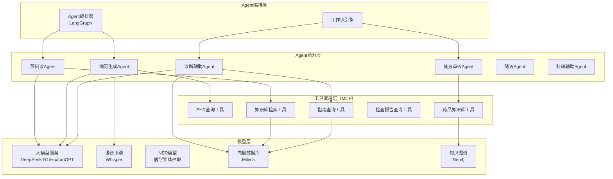
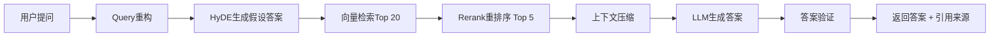

# M5：AI Agent引擎详细设计 ⭐⭐⭐

## 1. 模块概述

AI Agent引擎是MedMind Nexus的"大脑"，负责**多Agent协作编排、RAG知识库问答、医疗大模型微调与服务、MCP工具调用协议**。**核心价值：让AI从"问答机器"变成"能思考、能行动、能协作的医疗智能体"**。

这是整个项目技术含量最高的模块，也是你作为全栈开发者**最值得深入学习的模块**（市场单价50-200万）。

## 2. 架构设计

### 2.1 整体架构图（Mermaid）



### 2.2 技术选型详解

| 组件 | 选型 | 理由 | 学习价值 |
|------|------|------|----------|
| Agent编排框架 | **LangGraph** | 确定性执行（适合医疗）、状态管理强大、可视化工作流 | ⭐⭐⭐⭐⭐ |
| RAG框架 | **LlamaIndex** | 医疗RAG场景优化好、支持多种向量库 | ⭐⭐⭐⭐ |
| 大模型推理引擎 | **vLLM** | 高吞吐、PagedAttention内存优化 | ⭐⭐⭐ |
| 向量数据库 | **Milvus** | 大规模、GPU加速、企业级 | ⭐⭐⭐⭐ |
| 知识图谱 | **Neo4j** | 图查询语言Cypher易用、医疗知识图谱案例多 | ⭐⭐⭐ |
| MCP协议实现 | **自定义**（基于JSON-RPC 2.0） | Anthropic的MCP是新兴标准，自定义实现学习价值高 | ⭐⭐⭐⭐⭐ |
| A2A协议实现 | **自定义**（基于HTTP + SSE） | Google的A2A是新兴标准，学习多Agent通信 | ⭐⭐⭐⭐ |

## 3. 核心功能详细设计

### 3.1 多Agent协作编排（LangGraph实现）⭐

#### 3.1.1 完整就诊流程的多Agent协作

**场景**：患者从预问诊到诊后随访的完整流程，需要5个Agent协作。

**LangGraph工作流定义**：

```python
from langgraph.graph import StateGraph, END
from typing import TypedDict, Annotated, Sequence
import operator

# 定义状态（State）
class ConsultationState(TypedDict):
    patient_id: str
    messages: Annotated[list, operator.add]  # 对话历史
    pre_consultation_summary: dict  # 预问诊摘要
    soap_note: dict  # 病历
    diagnosis: list  # 诊断列表
    prescription: dict  # 处方
    follow_up_plan: dict  # 随访计划
    human_approval_needed: bool  # 是否需要人类确认

# 创建状态图
workflow = StateGraph(ConsultationState)

# 添加节点（Agent）
workflow.add_node("pre_consult", pre_consult_agent)
workflow.add_node("note_generation", note_generation_agent)
workflow.add_node("diagnosis", diagnosis_agent)
workflow.add_node("prescription", prescription_agent)
workflow.add_node("human_review", human_review_node)  # 人工审核节点
workflow.add_node("follow_up", follow_up_agent)

# 定义边（流程）
workflow.set_entry_point("pre_consult")

workflow.add_edge("pre_consult", "note_generation")
workflow.add_edge("note_generation", "diagnosis")

# 条件边：诊断后需要人工审核
workflow.add_conditional_edges(
    "diagnosis",
    should_continue,  # 判断函数
    {
        "needs_human_review": "human_review",
        "continue": "prescription"
    }
)

workflow.add_edge("human_review", "prescription")
workflow.add_edge("prescription", "follow_up")
workflow.add_edge("follow_up", END)

# 编译
app = workflow.compile()

# 执行
result = app.invoke({
    "patient_id": "patient_123",
    "messages": [],
    "human_approval_needed": False
})
```

#### 3.1.2 条件边判断函数（Human-in-the-loop）

```python
def should_continue(state: ConsultationState) -> str:
    """判断是否需要人工审核"""
    diagnosis = state["diagnosis"]
    
    # 规则1：如果AI诊断置信度 < 0.7，需要人工审核
    if diagnosis[0]["confidence"] < 0.7:
        return "needs_human_review"
    
    # 规则2：如果诊断包含高风险疾病（癌症、心梗等），需要人工审核
    high_risk_icd10 = ["C", "I21", "I63"]  # 肿瘤、心梗、脑梗
    for d in diagnosis:
        if any(d["icd10"].startswith(prefix) for prefix in high_risk_icd10):
            return "needs_human_review"
    
    # 规则3：如果处方包含高危药物（化疗药、抗凝药等），需要人工审核
    # ...（省略）
    
    return "continue"
```

#### 3.1.3 人工审核节点实现

```python
def human_review_node(state: ConsultationState):
    """人工审核节点：暂停执行，等待医生确认"""
    
    # 1. 推送审核请求给医生（企业微信/APP推送）
    notify_doctor_for_review(state)
    
    # 2. 等待医生审核（实际实现中用WebSocket或数据库轮询）
    # 在LangGraph中，这可以通过interrupt实现
    # 简化示例：
    while True:
        review_result = check_review_status(state["patient_id"])
        if review_result:
            break
        time.sleep(10)
    
    # 3. 根据审核结果更新状态
    if review_result["approved"]:
        state["diagnosis"] = review_result["revised_diagnosis"]
        state["human_approval_needed"] = False
    else:
        # 医生拒绝，返回修改
        state["human_approval_needed"] = True
    
    return state
```

**注意**：LangGraph的`interrupt`功能可以实现更优雅的暂停/恢复，参考LangGraph官方文档。

#### 3.1.4 完整工作流可视化

```
┌─────────────┐
│  患者打开小程序，启动预问诊          │
└─────────────┘
                ↓
┌─────────────┐
│  [Agent 1: 预问诊Agent]           │
│  - 多轮对话采集症状                │
│  - 生成结构化预问诊摘要            │
└─────────────┘
                ↓
┌─────────────┐
│  [Agent 2: 病历生成Agent]         │
│  - 输入：预问诊摘要 + 问诊对话    │
│  - 输出：SOAP格式病历草稿          │
└─────────────┘
                ↓
┌─────────────┐
│  [Agent 3: 诊断辅助Agent]         │
│  - 输入：病历 + 检查结果           │
│  - 输出：Top 3鉴别诊断            │
│  - ⚠️ 高风险诊断 → 触发人工审核  │
└─────────────┘
                ↓
┌─────────────┐
│  [Human-in-the-loop: 医生审核]    │
│  - 医生查看AI诊断建议              │
│  - 修改/确认                       │
└─────────────┘
                ↓
┌─────────────┐
│  [Agent 4: 处方审核Agent]         │
│  - 输入：诊断 + 患者过敏史        │
│  - 输出：处方建议 + 相互作用检查  │
└─────────────┘
                ↓
┌─────────────┐
│  [Agent 5: 随访Agent]             │
│  - 输入：诊断 + 处方               │
│  - 输出：随访计划                  │
└─────────────┘
                ↓
    完成！推送结果给患者和医生
```

### 3.2 RAG知识库问答（医疗场景深度优化）⭐

#### 3.2.1 RAG架构（Advanced RAG）

**基础RNaive RAG的问题**：
- 检索精度低（召回不相关文档）
- 缺乏上下文（只检索片段，不知道上下文）
- 无法处理否定问题（"哪些药物不用于治疗高血压？"）

**Advanced RAG解决方案**：



#### 3.2.2 Query重构实现

**问题**：用户提问"高血压怎么治？"太宽泛，检索效果差。

**解决方案**：用LLM重写查询。

```python
def rewrite_query(original_query: str, conversation_history: list) -> str:
    """重写用户查询，增加上下文"""
    
    prompt = f"""
    你是一位医学信息检索专家。
    
    【对话历史】
    {conversation_history}
    
    【用户原始提问】
    {original_query}
    
    【任务】
    重写为适合向量检索的查询式。要求：
    1. 提取核心医学术语
    2. 展开缩写（如"高血压" → "高血压 原发性高血压"）
    3. 补充同义词
    4. 输出3个查询式（从宽到严）
    
    【输出格式】
    {{
        "rewritten_queries": [
            "高血压 治疗 指南",
            "原发性高血压 药物治疗 第一线药物",
            "Hypertension treatment guideline first-line drugs"
        ]
    }}
    """
    
    response = llm.invoke(prompt)
    return json.loads(response)["rewritten_queries"]
```

#### 3.2.3 HyDE（Hypothetical Document Embeddings）

**原理**：先让LLM生成一个假设答案，再用假设答案的向量去检索（假设答案比原始问题更接近真实文档）。

```python
def hyde_retrieval(query: str, vector_db, top_k: int = 5):
    """HyDE检索"""
    
    # 1. 生成假设答案
    prompt = f"请回答以下问题（即使不确定也要给出一个合理的回答）：\n{query}"
    hypothetical_answer = llm.invoke(prompt)
    
    # 2. 用假设答案的向量检索
    query_embedding = embed_model.embed(hypothetical_answer)
    results = vector_db.search(query_embedding, top_k=top_k)
    
    return results
```

#### 3.2.4 Rerank重排序

**问题**：向量检索的Top 20结果中，可能只有前5个是真正相关的。

**解决方案**：用Rerank模型对Top 20重新排序，取Top 5。

```python
from sentence_transformers import CrossEncoder

rerank_model = CrossEncoder("BAAI/bge-reranker-large")

def rerank_results(query: str, candidates: list, top_k: int = 5):
    """重排序"""
    
    # 构造query-candidate对
    pairs = [[query, doc["content"]] for doc in candidates]
    
    # 计算相关性得分
    scores = rerank_model.predict(pairs)
    
    # 排序
    scored_docs = [(doc, score) for doc, score in zip(candidates, scores)]
    scored_docs.sort(key=lambda x: x[1], reverse=True)
    
    return [doc for doc, score in scored_docs[:top_k]]
```

#### 3.2.5 上下文压缩（Context Compression）

**问题**：检索到的文档片段可能很长，包含无关内容，浪费Token。

**解决方案**：用LLM提取与问题最相关的句子。

```python
def compress_context(query: str, retrieved_docs: list) -> str:
    """上下文压缩"""
    
    prompt = f"""
    【用户问题】
    {query}
    
    【检索到的文档】
    {retrieved_docs}
    
    【任务】
    从检索到的文档中提取与问题最相关的句子，删除无关内容。
    保持医学准确性，不要改写医学术语。
    """
    
    compressed_context = llm.invoke(prompt)
    return compressed_context
```

#### 3.2.6 完整RAG实现代码

```python
from llama_index import VectorStoreIndex, SimpleDirectoryReader
from llama_index.llms import DeepSeek
from llama_index.embeddings import HuggingFaceEmbedding
from llama_index.vector_stores import MilvusVectorStore

class MedicalRAGSystem:
    def __init__(self):
        # 1. 初始化嵌入模型
        self.embed_model = HuggingFaceEmbedding(model_name="BAAI/bge-large-zh-v1.5")
        
        # 2. 初始化向量数据库
        self.vector_store = MilvusVectorStore(
            uri="http://localhost:19530",
            collection_name="medical_guidelines",
            dim=1024  # bge-large-zh-v1.5的维度
        )
        
        # 3. 初始化LLM
        self.llm = DeepSeek(model="deepseek-r1", api_key="your_api_key")
        
        # 4. 构建RAG索引
        self.index = VectorStoreIndex.from_vector_store(
            vector_store=self.vector_store,
            embed_model=self.embed_model,
            llm=self.llm
        )
        
        # 5. 初始化Rerank模型
        self.rerank_model = CrossEncoder("BAAI/bge-reranker-large")
    
    def query(self, query: str, conversation_history: list = None) -> dict:
        """RAG查询"""
        
        # Step 1: Query重构
        rewritten_queries = rewrite_query(query, conversation_history or [])
        
        # Step 2: HyDE检索（对每个重写后的查询）
        all_results = []
        for q in rewritten_queries:
            hyde_results = hyde_retrieval(q, self.vector_store, top_k=20)
            all_results.extend(hyde_results)
        
        # 去重
        all_results = deduplicate_results(all_results)
        
        # Step 3: Rerank
        top_results = rerank_results(query, all_results, top_k=5)
        
        # Step 4: 上下文压缩
        compressed_context = compress_context(query, top_results)
        
        # Step 5: LLM生成答案
        prompt = f"""
        【系统指令】
        你是一位专业的医学AI助手。基于以下参考资料回答问题。
        如果参考资料不足以回答问题，明确说"根据现有资料无法回答"。
        不要编造信息。
        
        【参考资料】
        {compressed_context}
        
        【问题】
        {query}
        
        【输出格式】
        {{
            "answer": "答案（专业但通俗易懂）",
            "sources": ["来源1", "来源2"],
            "confidence": 0.85  // 0-1，表示答案的置信度
        }}
        """
        
        response = self.llm.invoke(prompt)
        result = json.loads(response)
        
        # Step 6: 答案验证（检查是否与参考资料一致）
        if result["confidence"] < 0.7:
            result["answer"] += "\n\n⚠️ 提示：AI对此答案的置信度较低，建议咨询专业医师。"
        
        return result
```

### 3.3 MCP工具调用协议实现 ⭐⭐⭐⭐⭐

#### 3.3.1 MCP协议简介

**MCP（Model Context Protocol）**：Anthropic主导的AI工具调用标准协议，让AI模型能统一调用各种外部工具（数据库、API、文件系统等）。

**核心概念**：
- **Tool（工具）**：AI可以调用的功能（如`search_patient_records`）
- **Resource（资源）**：AI可以读取的数据（如患者病历）
- **Prompt（提示词模板）**：预定义的Prompt

#### 3.3.2 自定义MCP Server实现（Python）

**场景**：让Agent能查询医院HIS系统中的患者信息。

```python
# mcp_server.py
from mcp import MCPServer, Tool, ToolParameter, ToolResult

# 创建MCP Server
server = MCPServer(name="hospital_his_mcp", version="1.0.0")

# 定义工具：查询患者病历
@server.tool(
    name="search_patient_records",
    description="根据患者ID或姓名查询病历记录",
    parameters=[
        ToolParameter(name="patient_id", type="string", required=False),
        ToolParameter(name="patient_name", type="string", required=False),
        ToolParameter(name="start_date", type="string", required=False),
        ToolParameter(name="end_date", type="string", required=False)
    ]
)
def search_patient_records(patient_id=None, patient_name=None, start_date=None, end_date=None):
    """实现工具逻辑"""
    
    # 连接HIS数据库
    conn = connect_his_database()
    
    # 构造SQL
    sql = "SELECT * FROM medical_records WHERE 1=1"
    params = []
    
    if patient_id:
        sql += " AND patient_id = %s"
        params.append(patient_id)
    
    if patient_name:
        sql += " AND patient_name LIKE %s"
        params.append(f"%{patient_name}%")
    
    if start_date:
        sql += " AND created_at >= %s"
        params.append(start_date)
    
    if end_date:
        sql += " AND created_at <= %s"
        params.append(end_date)
    
    # 执行查询
    results = conn.execute(sql, params).fetchall()
    
    # 返回结果（JSON格式）
    return ToolResult(
        content=json.dumps(results, ensure_ascii=False),
        mime_type="application/json"
    )

# 定义工具：获取检查报告
@server.tool(
    name="get_lab_report",
    description="根据检查单号获取检验报告",
    parameters=[
        ToolParameter(name="report_id", type="string", required=True)
    ]
)
def get_lab_report(report_id: str):
    """实现工具逻辑"""
    # ...（省略）
    pass

# 启动MCP Server（使用HTTP + JSON-RPC 2.0协议）
if __name__ == "__main__":
    server.run(host="0.0.0.0", port=8080)
```

#### 3.3.3 Agent调用MCP工具（LangChain集成）

```python
from langchain.agents import initialize_agent, Tool
from mcp_client import MCPClient

# 1. 连接MCP Server
mcp_client = MCPClient(base_url="http://localhost:8080")

# 2. 获取可用工具列表
available_tools = mcp_client.list_tools()

# 3. 将MCP工具转换为LangChain工具
langchain_tools = []
for mcp_tool in available_tools:
    langchain_tool = Tool(
        name=mcp_tool.name,
        description=mcp_tool.description,
        func=lambda **kwargs: mcp_client.call_tool(mcp_tool.name, kwargs),
    )
    langchain_tools.append(langchain_tool)

# 4. 初始化Agent
agent = initialize_agent(
    tools=langchain_tools,
    llm=llm,
    agent=AgentType.OPENAI_FUNCTIONS,
    verbose=True
)

# 5. 使用Agent
response = agent.run("查询患者张三的病历记录")
```

#### 3.3.4 MCP工具调用流程图

```
┌─────────────────┐
│  Agent（LangGraph）                     │
│  "我需要查询患者病历"                    │
└─────────────────┘
                     ↓
┌─────────────────┐
│  决策：需要调用工具                       │
│  选择工具：search_patient_records        │
│  构造参数：{"patient_name": "张三"}     │
└─────────────────┘
                     ↓
┌─────────────────┐
│  MCP Client                                 │
│  发送JSON-RPC 2.0请求：                   │
│  {                                         │
│    "jsonrpc": "2.0",                     │
│    "method": "tools/call",                │
│    "params": {                           │
│      "name": "search_patient_records",    │
│      "arguments": {"patient_name": "张三"}│
│    }                                     │
│  }                                       │
└─────────────────┘
                     ↓  HTTP请求
┌─────────────────┐
│  MCP Server（医院HIS）                    │
│  1. 验证权限（API Key/OAuth）            │
│  2. 执行工具逻辑（查询数据库）           │
│  3. 返回结果                             │
└─────────────────┘
                     ↓
┌─────────────────┐
│  Agent接收结果                               │
│  "找到3条记录：..."                        │
│  继续推理...                               │
└─────────────────┘
```

### 3.4 A2A协议实现（Agent间通信）⭐⭐⭐⭐

#### 3.4.1 A2A协议简介

**A2A（Agent-to-Agent Protocol）**：Google主导的Agent间通信协议，让不同系统、不同框架的Agent能互相发现、互相调用。

**核心概念**：
- **Agent Card**：Agent的"名片"，描述自己的能力（类似OpenAPI Spec）
- **Discovery**：Agent如何发现其他Agent
- **Task**：Agent间传递的任务单元

#### 3.4.2 Agent Card定义（JSON格式）

```json
{
  "agent_id": "pre_consult_agent",
  "name": "预问诊Agent",
  "version": "1.0.0",
  "description": "通过多轮对话采集患者症状、病史，生成结构化预问诊摘要",
  "capabilities": [
    {
      "name": "collect_symptoms",
      "description": "采集患者症状",
      "input_schema": {
        "type": "object",
        "properties": {
          "patient_id": {"type": "string"},
          "chief_complaint": {"type": "string"}
        }
      },
      "output_schema": {
        "type": "object",
        "properties": {
          "symptoms": {"type": "array", "items": {"type": "string"}},
          "urgency_level": {"type": "string"}
        }
      }
    }
  ],
  "endpoint": "http://localhost:9001/a2a",
  "auth": {
    "type": "bearer",
    "token_url": "http://localhost:9000/auth/token"
  }
}
```

#### 3.4.3 Agent间通信实现

**场景**：预问诊Agent完成后，将结果传递给病历生成Agent。

```python
import requests
from typing import dict, Any

class A2AClient:
    """A2A协议客户端"""
    
    def __init__(self, agent_card_url: str):
        self.agent_card_url = agent_card_url
        self.agent_card = self._fetch_agent_card()
        self.access_token = None
    
    def _fetch_agent_card(self) -> dict:
        """获取Agent Card"""
        response = requests.get(self.agent_card_url)
        return response.json()
    
    def _get_access_token(self) -> str:
        """获取访问令牌"""
        if not self.access_token:
            # 调用OAuth2.0获取token
            token_url = self.agent_card["auth"]["token_url"]
            response = requests.post(token_url, data={
                "grant_type": "client_credentials",
                "client_id": "your_client_id",
                "client_secret": "your_client_secret"
            })
            self.access_token = response.json()["access_token"]
        
        return self.access_token
    
    def invoke_capability(self, capability_name: str, inputs: dict) -> Any:
        """调用Agent的能力"""
        
        # 1. 查找能力
        capability = None
        for cap in self.agent_card["capabilities"]:
            if cap["name"] == capability_name:
                capability = cap
                break
        
        if not capability:
            raise ValueError(f"Capability {capability_name} not found")
        
        # 2. 构造A2A请求
        a2a_request = {
            "jsonrpc": "2.0",
            "method": f"agent/{capability_name}",
            "params": {
                "inputs": inputs
            },
            "id": "req_12345"
        }
        
        # 3. 发送请求
        headers = {
            "Authorization": f"Bearer {self._get_access_token()}",
            "Content-Type": "application/json"
        }
        
        endpoint = self.agent_card["endpoint"]
        response = requests.post(endpoint, json=a2a_request, headers=headers)
        
        # 4. 解析响应
        result = response.json()
        
        if "error" in result:
            raise Exception(f"A2A call failed: {result['error']}")
        
        return result["result"]

# 使用示例
pre_consult_client = A2AClient("http://localhost:9001/a2a/card")

# 调用预问诊Agent
pre_consult_result = pre_consult_client.invoke_capability(
    "collect_symptoms",
    {
        "patient_id": "patient_123",
        "chief_complaint": "胸闷2周"
    }
)

# 将结果传递给病历生成Agent
note_gen_client = A2AClient("http://localhost:9002/a2a/card")
note_result = note_gen_client.invoke_capability(
    "generate_soap_note",
    {
        "pre_consultation_summary": pre_consult_result["summary"],
        "conversation": pre_consult_result["conversation"]
    }
)
```

### 3.5 医疗大模型微调（LoRA方法）⭐⭐⭐

#### 3.5.1 为什么要微调？

**通用大模型的问题**：
- 不熟悉医院专有术语（如"ICD-10编码"）
- 不了解医院工作流程（如"门诊→住院→手术→出院"）
- 输出格式不符合要求（如病历格式、处方格式）

**微调的价值**：
- 让模型学习医院的历史病历数据
- 让模型输出符合医院规范的格式
- 提升模型在特定专科领域的准确性

#### 3.5.2 LoRA微调实战

**LoRA（Low-Rank Adaptation）**：只训练模型的一小部分参数（低秩矩阵），大幅降低显存需求。

**环境准备**：
```bash
# 安装依赖
pip install transformers accelerate peft bitsandbytes datasets

# 下载基础模型（DeepSeek-R1 7B）
huggingface-cli download deepseek-ai/deepseek-r1-7b --local-dir ./models/deepseek-r1-7b
```

**数据准备（JSONL格式）**：
```jsonl
{"instruction": "根据以下问诊对话生成SOAP病历", "input": "医生：您哪里不舒服？\n患者：我胸闷2周...", "output": "S（主诉）：胸闷2周，活动后加重...\nO（客观）：...\nA（评估）：...\nP（计划）：..."}
{"instruction": "判断以下症状最可能的诊断", "input": "症状：胸痛、出汗、恶心呕吐", "output": "考虑：1. 急性心肌梗死（可能性最高）\n2. ..."}
```

**微调代码（使用Hugging Face PEFT）**：
```python
from transformers import AutoModelForCausalLM, AutoTokenizer, TrainingArguments
from peft import LoraConfig, get_peft_model, prepare_model_for_kbit_training
from datasets import load_dataset
import torch

# 1. 加载基础模型（4-bit量化，节省显存）
model = AutoModelForCausalLM.from_pretrained(
    "./models/deepseek-r1-7b",
    load_in_4bit=True,
    torch_dtype=torch.bfloat16,
    device_map="auto"
)
model = prepare_model_for_kbit_training(model)

tokenizer = AutoTokenizer.from_pretrained("./models/deepseek-r1-7b")

# 2. 配置LoRA
lora_config = LoraConfig(
    r=16,  # LoRA秩（越大参数越多，通常8-64）
    lora_alpha=32,  # LoRA缩放因子
    target_modules=["q_proj", "v_proj"],  # 只训练Q和V矩阵
    lora_dropout=0.05,
    bias="none",
    task_type="CAUSAL_LM"
)

model = get_peft_model(model, lora_config)

# 3. 加载数据集
dataset = load_dataset("json", data_files="./data/medical_notes.jsonl", split="train")

def tokenize_function(examples):
    """Tokenize数据"""
    prompts = []
    for instr, inp, out in zip(examples["instruction"], examples["input"], examples["output"]):
        prompt = f"### 指令：\n{instr}\n\n### 输入：\n{inp}\n\n### 输出：\n{out}"
        prompts.append(prompt)
    
    return tokenizer(prompts, padding="max_length", truncation=True, max_length=2048)

tokenized_dataset = dataset.map(tokenize_function, batched=True)

# 4. 训练配置
training_args = TrainingArguments(
    output_dir="./models/deepseek-r1-7b-lora-medical",
    per_device_train_batch_size=4,
    gradient_accumulation_steps=4,
    num_train_epochs=3,
    learning_rate=2e-4,
    fp16=True,
    logging_steps=10,
    save_steps=500,
    save_total_limit=2
)

# 5. 开始训练
trainer = Trainer(
    model=model,
    args=training_args,
    train_dataset=tokenized_dataset,
    data_collator=DataCollatorForSeq2Seq(tokenizer, padding=True)
)

trainer.train()

# 6. 保存LoRA权重（只保存少量参数，约40MB）
model.save_pretrained("./models/deepseek-r1-7b-lora-medical")
```

**推理时使用LoRA权重**：
```python
from peft import PeftModel

# 加载基础模型
base_model = AutoModelForCausalLM.from_pretrained("./models/deepseek-r1-7b")
tokenizer = AutoTokenizer.from_pretrained("./models/deepseek-r1-7b")

# 加载LoRA权重
model = PeftModel.from_pretrained(base_model, "./models/deepseek-r1-7b-lora-medical")

# 推理
prompt = "### 指令：\n根据以下问诊对话生成SOAP病历\n\n### 输入：\n..."
inputs = tokenizer(prompt, return_tensors="pt").to("cuda")
outputs = model.generate(**inputs, max_length=2048)
result = tokenizer.decode(outputs[0], skip_special_tokens=True)
print(result)
```

## 4. 性能优化

### 4.1 vLLM推理加速

**问题**：大模型推理速度慢，影响用户体验。

**解决方案**：使用vLLM（PagedAttention技术，类似OS的虚拟内存）。

```bash
# 启动vLLM服务器
python -m vllm.entrypoints.openai.api_server \
    --model ./models/deepseek-r1-7b-lora-medical \
    --tensor-parallel-size 2 \  # 2张GPU
    --gpu-memory-utilization 0.9 \
    --max-num-seqs 256  # 并发请求数
```

**Python客户端调用**：
```python
from openai import OpenAI

# vLLM兼容OpenAI API
client = OpenAI(
    base_url="http://localhost:8000/v1",
    api_key="dummy"  # vLLM不需要真实API Key
)

response = client.chat.completions.create(
    model="./models/deepseek-r1-7b-lora-medical",
    messages=[
        {"role": "system", "content": "你是一位专业的医疗AI助手"},
        {"role": "user", "content": "根据以下问诊对话生成SOAP病历..."}
    ],
    temperature=0.7,
    max_tokens=2048
)

print(response.choices[0].message.content)
```

### 4.2 模型量化（INT8/INT4）

**问题**：大模型显存占用高（DeepSeek-R1 67B需要约134GB显存）。

**解决方案**：量化（INT8量化显存减半，INT4量化显存减为1/4）。

```python
# INT8量化（使用bitsandbytes）
model = AutoModelForCausalLM.from_pretrained(
    "./models/deepseek-r1-67b",
    load_in_8bit=True,  # INT8量化
    device_map="auto"
)

# INT4量化（更激进）
model = AutoModelForCausalLM.from_pretrained(
    "./models/deepseek-r1-67b",
    load_in_4bit=True,  # INT4量化
    bnb_4bit_compute_dtype=torch.bfloat16,
    device_map="auto"
)
```

## 5. 测试方案

### 5.1 Agent工作流测试

**测试工具**：LangGraph的`langgraph_test`

```python
from langgraph_test import LangGraphTest

def test_complete_consultation_workflow():
    """测试完整就诊工作流"""
    
    test_state = {
        "patient_id": "test_patient_001",
        "messages": [
            {"role": "user", "content": "我胸闷2周"}
        ],
        "human_approval_needed": False
    }
    
    # 执行工作流
    result = app.invoke(test_state)
    
    # 断言
    assert "pre_consultation_summary" in result
    assert "soap_note" in result
    assert "diagnosis" in result
    assert len(result["diagnosis"]) > 0
    assert "prescription" in result
```

### 5.2 RAG检索精度测试

**测试数据集**：医学问答数据集（如CMB、MedQA）

```python
def test_rag_retrieval_accuracy():
    """测试RAG检索精度"""
    
    test_queries = [
        ("高血压的一线治疗药物有哪些？", ["ACEI", "ARB", "CCB", "利尿剂"]),
        ("冠心病的诊断标准是什么？", ["胸痛", "心电图", "心肌酶", "冠脉造影"])
    ]
    
    for query, expected_keywords in test_queries:
        result = rag_system.query(query)
        
        # 检查答案是否包含预期关键词
        for keyword in expected_keywords:
            assert keyword in result["answer"], f"答案中未找到关键词：{keyword}"
        
        # 检查置信度
        assert result["confidence"] > 0.7, "答案置信度过低"
```

---

> **交付说明**：本文档深入讲解了AI Agent引擎的全部核心技术，包括LangGraph多Agent编排、MCP工具调用、A2A协议、RAG优化、模型微调等。**这是整个项目技术含量最高的部分，也是你作为全栈开发者最值得深入学习的模块**。建议先实现"单Agent（预问诊）"作为MVP，再逐步扩展到多Agent协作。
