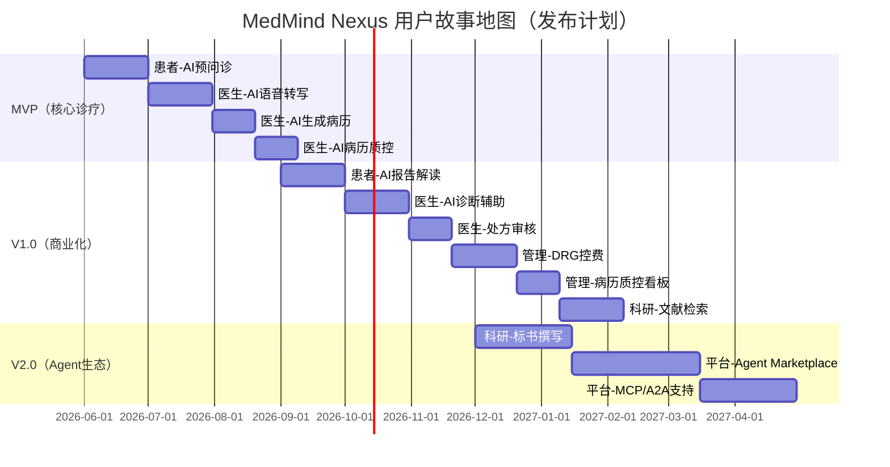

# 用户故事地图（User Story Mapping）

## 1. 文档概述

**用户故事地图**是敏捷需求分析工具，将用户故事按"用户活动 → 用户任务 → 用户故事"三级结构组织，帮助团队：
1. 看清产品全貌
2. 识别MVP范围
3. 规划发布计划

本文档覆盖MedMind Nexus全部4类用户角色的用户故事。

## 2. 用户角色图谱

```
MedMind Nexus 用户角色
├── 患者（Patient）
│   ├── 普通患者（18-65岁，有一定数字素养）
│   ├── 老年患者（>65岁，数字素养低）
│   └── 慢病患者（需要长期随访）
├── 医生（Doctor）
│   ├── 主治医师（主要使用者）
│   ├── 住院医师（病历书写主力）
│   └── 科主任（质控需求）
├── 药师（Pharmacist）
│   ├── 门诊药师（处方审核）
│   └── 临床药师（用药指导）
├── 管理员（Administrator）
│   ├── 医院管理员（运营管理）
│   ├── 科室主任（质控管理）
│   ├── 信息科（系统配置）
│   └── 院长（决策分析）
└── AI Agent（系统内部角色）
    ├── 预问诊Agent
    ├── 病历生成Agent
    ├── 诊断辅助Agent
    ├── 处方审核Agent
    └── 随访Agent
```

## 3. 患者端用户故事地图

### 3.1 用户活动：就诊前准备

| 用户任务 | 用户故事（User Story） | 优先级 | 发布版本 |
|---------|------------------------|--------|----------|
| 挂号预约 | 作为患者，我希望能在线挂号，以便选择合适的时间和医生 | Must | V1.0 |
| 选择就诊科室 | 作为患者，我希望AI能根据我的症状推荐科室，以免挂错号 | Should | V1.0 |
| AI预问诊 | 作为患者，我希望在就诊前通过AI描述症状，以便医生提前了解我的情况 | Must | MVP |
| 预问诊紧急预警 | 作为患者，我希望AI能识别紧急情况并提示我立即就医，以免耽误病情 | Must | MVP |
| 查看预问诊摘要 | 作为患者，我希望能查看AI生成的预问诊摘要，以便确认信息准确 | Could | V1.0 |

**验收标准示例（AI预问诊）**：
```
Given 患者已挂号
When 患者打开小程序进入预问诊
Then AI通过多轮对话采集症状、病史、用药史
And 生成结构化预问诊摘要（JSON格式）
And 推送给接诊医生
And 整个流程不超过5分钟
```

### 3.2 用户活动：就诊中

| 用户任务 | 用户故事 | 优先级 | 发布版本 |
|---------|----------|--------|----------|
| 查看医生信息 | 作为患者，我希望查看接诊医生的专业方向和患者评价，以便建立信任 | Could | V2.0 |
| 查看检查报告 | 作为患者，我希望能及时查看检查结果，以免反复询问医生 | Should | V1.0 |
| AI报告解读 | 作为患者，我希望AI能用通俗语言解释检查报告，以便我理解异常指标 | Should | V1.0 |
| 查看处方 | 作为患者，我希望能查看医生开具的处方和用药说明，以便正确服药 | Must | V1.0 |

### 3.3 用户活动：就诊后随访

| 用户任务 | 用户故事 | 优先级 | 发布版本 |
|---------|----------|--------|----------|
| 用药提醒 | 作为患者，我希望收到用药提醒，以免漏服或忘服药物 | Should | V1.0 |
| AI随访问卷 | 作为患者，我希望能收到AI定制的随访问卷，以便医生了解我的恢复情况 | Could | V2.0 |
| 查看随访计划 | 作为患者，我希望能查看医生的随访计划，以便按时复诊 | Should | V1.0 |
| 健康建议推送 | 作为慢病患者，我希望收到个性化的健康建议，以便改善生活习惯 | Could | V2.0 |

## 4. 医生端用户故事地图

### 4.1 用户活动：诊前准备

| 用户任务 | 用户故事 | 优先级 | 发布版本 |
|---------|----------|--------|----------|
| 查看今日预约 | 作为医生，我希望查看今天的预约患者列表，以便合理安排时间 | Must | MVP |
| 查看预问诊摘要 | 作为医生，我希望在患者进入诊室前查看AI预问诊摘要，以便提前了解病情 | Must | MVP |
| 查看患者历史病历 | 作为医生，我希望快速查看患者的历史就诊记录和用药史，以便全面了解病情 | Must | MVP |

### 4.2 用户活动：诊间诊疗（核心价值）

| 用户任务 | 用户故事 | 优先级 | 发布版本 |
|---------|----------|--------|----------|
| AI实时语音转写 | 作为医生，我希望AI能实时将我和患者的对话转成文字，以免手动记录 | Must | MVP |
| 角色分离 | 作为医生，我希望AI能区分"医生说的"和"患者说的"，以便生成规范的病历 | Must | MVP |
| AI生成病历草稿 | 作为医生，我希望问诊结束后AI能自动生成SOAP格式病历草稿，以便我只需审核修改 | Must | MVP |
| 医学术语校正 | 作为医生，我希望AI能识别并校正医学术语（如"高血压"而非"血压高"），以便病历专业规范 | Should | V1.0 |
| AI实时诊断建议 | 作为医生，我希望问诊时AI能实时给出诊断建议，以便我斟酌参考 | Should | V1.0 |
| 检查检验建议 | 作为医生，我希望AI能根据症状和体征建议必要的检查，以免遗漏 | Should | V1.0 |

**验收标准示例（AI生成病历草稿）**：
```
Given 医生完成问诊
When 点击"生成病历草稿"
Then AI在5秒内生成SOAP格式病历
And 主诉引用患者原话
And 诊断列出Top 3鉴别诊断
And 医生可对草稿进行编辑
And AI生成的内容用黄色背景高亮显示
```

### 4.3 用户活动：诊后工作

| 用户任务 | 用户故事 | 优先级 | 发布版本 |
|---------|----------|--------|----------|
| AI病历质控 | 作为医生，我希望AI能检查病历的完整性和有效性，以免遗漏重要内容 | Must | V1.0 |
| 处方开具 | 作为医生，我希望能快速开具处方，并且AI能检查药物相互作用 | Must | V1.0 |
| 处方审核（药师） | 作为药师，我希望AI能辅助审查处方合理性，以免发生用药错误 | Must | V1.0 |
| 随访计划制定 | 作为医生，我希望能制定AI辅助的随访计划，以便自动跟进患者恢复情况 | Should | V1.0 |
| 科研数据导出 | 作为医生，我希望能导出科研所需的结构化数据，以便进行临床研究 | Could | V2.0 |

## 5. 管理端用户故事地图

### 5.1 用户活动：运营管理

| 用户任务 | 用户故事 | 优先级 | 发布版本 |
|---------|----------|--------|----------|
| 患者流量监控 | 作为管理员，我希望实时查看各科室患者流量，以便合理调配资源 | Should | V1.0 |
| 医生工作量统计 | 作为科主任，我希望查看医生的工作量统计（接诊量、病历质量），以便绩效考核 | Should | V1.0 |
| 患者满意度调查 | 作为管理员，我希望收集患者对医疗服务的满意度评价，以便改进服务 | Could | V2.0 |

### 5.2 用户活动：医疗质控（核心价值）

| 用户任务 | 用户故事 | 优先级 | 发布版本 |
|---------|----------|--------|----------|
| 病历质控看板 | 作为质控员，我希望查看全院病历质控情况，以便及时发现问题 | Must | V1.0 |
| 抗生素使用监控 | 作为科主任，我希望监控科室抗生素使用率，以免滥用 | Should | V1.0 |
| 合理用药分析 | 作为药师，我希望分析全院合理用药情况，以便提供药学服务 | Should | V1.0 |
| 医疗安全事件上报 | 作为管理员，我希望能上报和追踪医疗安全事件，以便持续改进 | Must | V1.0 |

### 5.3 用户活动：DRG医保控费（高价值）

| 用户任务 | 用户故事 | 优先级 | 发布版本 |
|---------|----------|--------|----------|
| DRG分组预测 | 作为医生，我希望入院时就能预测DRG分组和费用，以便控制成本 | Must | V1.0 |
| 医保费用预警 | 作为医生，我希望在费用超支前收到预警，以免医院亏损 | Must | V1.0 |
| 亏损病案分析 | 作为院长，我希望分析亏损病案的原因，以便优化成本结构 | Should | V2.0 |
| 病种费用对比 | 作为院长，我希望对比各病种的盈亏情况，以便调整发展策略 | Could | V2.0 |

## 6. 科研端用户故事地图

### 6.1 用户活动：文献检索与管理

| 用户任务 | 用户故事 | 优先级 | 发布版本 |
|---------|----------|--------|----------|
| 智能文献检索 | 作为研究者，我希望AI能帮我检索相关文献，以便快速了解研究现状 | Must | V1.0 |
| 文献AI摘要 | 作为研究者，我希望AI能总结文献的核心发现，以便快速判断是否精读 | Should | V1.0 |
| 研究趋势分析 | 作为研究者，我希望查看某领域的研究趋势，以便发现研究热点 | Could | V2.0 |
| 文献管理 | 作为研究者，我希望能管理我的文献库（收藏、标签、笔记），以便写作时引用 | Should | V1.0 |

### 6.2 用户活动：科研数据分析

| 用户任务 | 用户故事 | 优先级 | 发布版本 |
|---------|----------|--------|----------|
| 数据导入 | 作为研究者，我希望能导入Excel/CSV/SPSS数据，以便进行分析 | Must | V1.0 |
| 统计方法推荐 | 作为研究者，我希望AI能推荐合适的统计方法，以免方法错误 | Must | V1.0 |
| 自动统计分析 | 作为研究者，我希望AI能自动执行统计分析并生成图表，以免手工操作 | Should | V1.0 |
| 统计报告生成 | 作为研究者，我希望AI能生成符合医学期刊要求的统计报告，以便直接用于论文 | Should | V1.0 |

### 6.3 用户活动：基金标书撰写（高价值）

| 用户任务 | 用户故事 | 优先级 | 发布版本 |
|---------|----------|--------|----------|
| 标书智能生成 | 作为申请人，我希望AI能根据我的研究想法生成标书初稿，以便快速启动写作 | Must | V2.0 |
| 研究基础梳理 | 作为申请人，我希望AI能帮我梳理研究基础（前期成果、团队优势），以便突出优势 | Should | V2.0 |
| 技术路线图生成 | 作为申请人，我希望AI能生成技术路线图（Mermaid格式），以便直观展示研究方案 | Should | V2.0 |
| 标书质量评估 | 作为申请人，我希望AI能评估标书质量并给出改进建议，以便提升中标率 | Must | V2.0 |

## 7. 发布计划（Release Planning）

### 7.1 MVP（第1-3个月）：核心诊疗流程跑通

**目标**：医生能真正用AI助手完成一次完整问诊并生成病历

**包含用户故事**：
- 患者端：AI预问诊（Must）
- 医生端：AI实时语音转写、AI生成病历草稿、AI病历质控（Must）
- 管理端：基础患者/医生管理
- AI Agent：预问诊Agent、病历生成Agent（单Agent）

**可交付成果**：
- PC桌面端（Tauri）：诊间助手核心功能
- 微信小程序：AI预问诊
- 后端API服务
- AI Agent引擎（2个Agent）
- 基础RAG知识库（内科学指南）

### 7.2 V1.0（第4-6个月）：商业化准备

**目标**：达到可销售状态，完成等保三级合规

**新增用户故事**：
- 患者端：AI报告解读、用药提醒（Should）
- 医生端：AI诊断辅助、处方审核（Should）
- 管理端：DRG分组预测、医保费用预警、病历质控看板（Must）
- 科研端：智能文献检索、文献AI摘要（Must）

**可交付成果**：
- 多医院多租户架构
- HIS/LIS/PACS系统对接
- 等保三级合规改造
- 私有化部署方案（Docker Compose一键部署）
- AI Agent引擎（5个Agent + 多Agent协作）

### 7.3 V2.0（第7-12个月）：Agent生态 + 科研模块

**目标**：成为医疗AI Agent平台，支持第三方Agent接入

**新增用户故事**：
- 患者端：AI随访问卷、健康建议推送（Could）
- 医生端： advanced AI诊断建议、检查检验建议（Could）
- 管理端：亏损病案分析、病种费用对比（Could）
- 科研端：标书智能生成、标书质量评估（Must）
- 平台：Agent Marketplace、MCP协议全面支持、A2A协议支持

**可交付成果**：
- Agent Marketplace（第三方Agent上架）
- 科研辅助模块（文献检索、统计分析、标书撰写）
- MCP/A2A协议全面支持（让第三方工具接入）
- 多医院Agent协作（如：基层医院Agent → 三甲医院Agent远程会诊）

## 8. 用户故事优先级评估（MoSCoW法总结）

| 优先级 | 定义 | 数量（估算） | 发布版本 |
|--------|------|-------------|----------|
| **Must Have** | 必须有，否则产品无法使用 | ~25个 | MVP + V1.0 |
| **Should Have** | 应该有，不影响核心功能 | ~30个 | V1.0 + V2.0 |
| **Could Have** | 可以有，锦上添花 | ~20个 | V2.0或以后 |
| **Won't Have** | 本期不做 | ~10个 | 未来版本 |

## 9. 用户故事地图可视化（Mermaid）



---

> **交付说明**：本文档用用户故事地图（User Story Mapping）方法，将MedMind Nexus的全部功能需求转化为用户故事，并完成了优先级排序和发布计划。作为练手项目，你可以按照MVP → V1.0 → V2.0的节奏，逐步完成所有用户故事。
