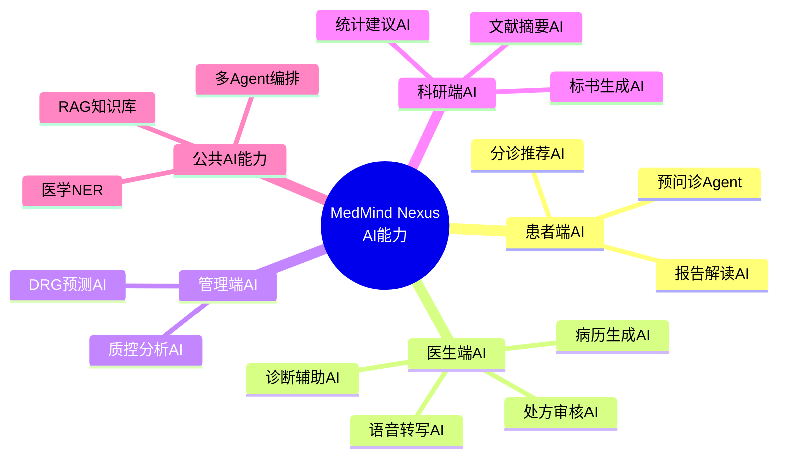

# AI能力说明书

## 1. 文档概述

本文档详细定义MedMind Nexus医智中枢的**全部AI能力**，包括：
- 每个AI功能的输入/输出规格
- 使用的模型和技术方案
- 性能指标和验收标准
- Prompt工程规范
- 错误处理和降级策略

**目标读者**：AI工程师、后端开发者、产品经理、医学顾问

## 2. AI能力总览



## 3. 患者端AI能力

### 3.1 预问诊Agent（Pre-consultation Agent）

#### 3.1.1 功能定义
通过多轮对话采集患者症状、病史、用药史、过敏史，生成结构化预问诊摘要，推送给医生。

#### 3.1.2 技术架构

```
输入：患者主诉（文本/语音）
  ↓
【Layer 1：ASR语音识别】（如果是语音输入）
  Whisper-large-v3 / 讯飞医疗ASR
  ↓
【Layer 2：意图理解】
  DeepSeek-R1 Medical（Few-shot Prompt）
  ↓
【Layer 3：实体抽取】
  医学NER模型（BiLSTM-CRF）
  抽取：症状、部位、持续时间、严重程度
  ↓
【Layer 4：多轮对话管理】
  LangChain Agent（Zero-shot React）
  Tools: [symptom_checker, urgency_assessor, medical_history_collector]
  ↓
【Layer 5：摘要生成】
  DeepSeek-R1 Medical（Structured Output）
  输出JSON：{chief_complaint, history_present_illness, ...}
  ↓
输出：结构化预问诊摘要（JSON）
```

#### 3.1.3 输入/输出规格

**输入**：
```typescript
interface PreConsultationInput {
  patient_id: string;  // UUID
  department: string;   // 就诊科室
  chief_complaint?: string;  // 患者主诉（可选，如果有）
  conversation_history?: Array<{role: 'user' | 'assistant', content: string}>;
}
```

**输出**：
```typescript
interface PreConsultationOutput {
  session_id: string;  // 会话ID
  summary: {
    chief_complaint: string;
    history_present_illness: string;
    past_history: string[];
    medications: string[];
    allergies: string[];
    urgency_level: 'low' | 'medium' | 'high' | 'emergency';
  };
  conversation: Array<{role: string, content: string}>;  // 完整对话
  warnings: string[];  // 预警信息（如紧急症状）
}
```

#### 3.1.4 Prompt模板（核心）

**系统Prompt**：
```
你是一位专业的医疗预问诊AI助手。

【角色定义】
你负责通过多轮对话采集患者的：
1. 主诉（Chief Complaint）
2. 现病史（History of Present Illness）
3. 既往史（Past Medical History）
4. 用药史（Current Medications）
5. 过敏史（Allergies）

【对话规则】
1. 每次只问1-2个问题，避免一次性问太多
2. 按照"主诉 → 现病史 → 既往史 → 用药史 → 过敏史"的顺序采集
3. 使用通俗易懂的语言，避免专业术语
4. 如果患者出现紧急症状（胸痛、呼吸困难、意识障碍、大出血），立即输出：
   【紧急预警】您的症状需要立即就医！请立即前往最近的医院急诊科。
   然后终止采集。

【输出规则】
1. 对话过程中，用自然对话语气
2. 采集完成后，输出JSON格式的结构化摘要
3. 不要给出诊断结论，只做信息收集

【输出格式（采集完成时）】
{
  "chief_complaint": "...",
  "history_present_illness": "...",
  "past_history": ["高血压", "糖尿病"],
  "medications": ["二甲双胍 0.5g bid"],
  "allergies": ["青霉素"],
  "urgency_level": "medium"
}

现在开始对话，问候患者并引导其描述症状。
```

#### 3.1.5 性能要求

| 指标 | 目标值 | 测量方法 |
|------|--------|---------|
| 信息完整度 | > 85% | 人工评估预问诊摘要与最终病历的覆盖率 |
| 紧急症状识别召回率 | 100% | 测试集（100个紧急案例） |
| 紧急症状识别精确率 | > 95% | 测试集（100个非紧急案例） |
| 多轮对话轮次 | < 10轮 | 统计平均值 |
| 响应延迟（P95） | < 3秒 | 生产环境监控 |

---

### 3.2 报告解读AI（Lab Report Interpretation AI）

#### 3.2.1 功能定义
上传检查报告图片或PDF，AI自动识别、提取、解读，标注异常指标并给出健康建议。

#### 3.2.2 技术架构

```
输入：报告图片/PDF
  ↓
【Layer 1：OCR识别】
  Paddle OCR（中文医疗场景优化）/ Azure Cognitive Services OCR
  ↓
【Layer 2：结构化提取】
  规则引擎 + 正则匹配
  提取：检查项目、结果、参考范围、单位
  ↓
【Layer 3：异常检测】
  规则判断：结果是否在参考范围内
  标注：↑（偏高）、↓（偏低）、❗（危急值）
  ↓
【Layer 4：AI解读生成】
  DeepSeek-R1 Medical（Few-shot Prompt）
  输入：结构化报告数据
  输出：通俗易懂的解读 + 健康建议
  ↓
输出：解读结果（Markdown格式）
```

#### 3.2.3 Prompt模板

```
你是一位专业的检验报告解读AI助手。

【输入：检验报告数据】
{{lab_report_data}}

【任务】
1. 用通俗易懂的语言解释每项结果
2. 标注异常指标（使用↑或↓），并解释可能的原因
3. 给出生活建议或就医建议
4. 不要给出诊断结论

【输出格式（Markdown）】
## 检验结果解读

### 血常规
- 白细胞（WBC）：6.5 ×10^9/L（正常）
  - 解读：白细胞计数正常，提示无急性感染。
- 血红蛋白（HGB）：105 g/L（↓ 偏低）
  - 解读：血红蛋白偏低，可能存在贫血。建议进一步查铁蛋白、维生素B12等指标。
  - 生活建议：多食含铁丰富的食物（瘦肉、动物肝脏、菠菜等）。

### 生化检查
...

### 总体建议
1. 建议到血液科就诊，明确贫血原因。
2. 饮食注意均衡营养。
3. 1个月后复查血常规。

【重要】
- 本解读仅供参考，不能替代医师诊断。
- 如有疑问，请咨询您的主治医师。
```

---

## 4. 医生端AI能力

### 4.1 语音转写AI（Medical ASR AI）

#### 4.1.1 功能定义
实时将医生和患者的对话转成文字，并区分"医生"和"患者"角色。

#### 4.1.2 技术架构

```
输入：麦克风音频流（16kHz，单声道）
  ↓
【实时流式ASR】
  Whisper-large-v3（local） / 讯飞医疗ASR（云端）
  输出：带时间戳的文本片段
  ↓
【角色分离】
  方案1：基于规则的简单分离（医生说话更长、更专业）
  方案2：PyAnnote（说话人分离模型）
  输出：{role: "doctor"|"patient", text: "...", timestamp: ...}
  ↓
【医学术语后处理】
  术语词典替换（"xiong men" → "胸闷"）
  ↓
输出：带角色的对话文本
```

#### 4.1.3 性能指标

| 指标 | 目标值 | 测试方法 |
|------|--------|---------|
| 中文普通话识别准确率（Word Error Rate, WER） | < 8% | 标准医疗语音测试集（1000条） |
| 医学术语识别准确率 | > 92% | 医学专业术语测试集（500条） |
| 角色分离准确率 | > 85% | 人工标注对照 |
| 实时延迟（从说话到显示文字） | < 3秒 | 生产环境监控（P95） |

---

### 4.2 病历生成AI（Medical Note Generation AI）⭐

#### 4.2.1 功能定义
根据问诊对话（医生+患者），生成SOAP格式的电子病历草稿。

#### 4.2.2 Prompt模板（核心）

```
你是一位专业的医疗AI助手，负责根据问诊对话生成符合规范的电子病历。

【输入】
## 问诊对话记录
医生：您好，请描述您的症状。
患者：我最近经常胸闷，尤其是活动后。
医生：这种情况有多久了？
患者：大概两周了。
...（完整对话）...

## 患者基本信息
姓名：张三（脱敏）
性别：男
年龄：45岁
过敏史：青霉素

【任务】
生成SOAP格式的电子病历。

S（Subjective，主诉）：
- 引用患者原话
- 格式："胸闷2周，活动后加重"

O（Objective，客观检查）：
- 如果对话中有体格检查，记录在此
- 如果没有，填写"未见明显异常"或"[待补充]"

A（Assessment，评估/诊断）：
- 列出Top 3鉴别诊断（按可能性排序）
- 使用ICD-10编码格式
- 例如："I20.0 不稳定型心绞痛（考虑）"

P（Plan，计划）：
- 建议进一步检查（如：心电图、心肌酶、冠脉CTA）
- 治疗建议（如：注意休息、避免剧烈活动）
- 随访建议（如：3天后复诊）

【要求】
1. 使用专业但简洁的医疗术语
2. 不添加未经对话确认的内容
3. 如果信息不足，在对应字段标注"[需补充]"
4. 诊断建议用"考虑"而非"确诊"
5. 输出严格的JSON格式，方便前端渲染

【输出格式】
{
  "subjective": "胸闷2周，活动后加重",
  "objective": "未见明显异常",
  "assessment": [
    {"icd10": "I20.0", "diagnosis": "不稳定型心绞痛", "probability": 0.75},
    {"icd10": "K21.0", "diagnosis": "胃食管反流病", "probability": 0.15},
    {"icd10": "F41.9", "diagnosis": "焦虑状态", "probability": 0.10}
  ],
  "plan": "建议进一步检查：心电图、心肌酶、冠脉CTA。治疗建议：避免剧烈活动...",
  "confidence": 0.82
}
```

#### 4.2.3 幻觉控制策略（医疗AI生死攸关！）

**第一层：Prompt护栏**
```
【强制规则】
1. 如果对话中未提及某项信息，禁止在病历中编造。
2. 如果信息不足，必须在对应字段标注"[需补充]"。
3. 诊断建议用"考虑"而非"确诊"。
4. 禁止给出确定性的预后判断（如"5年生存率XX%"）。
```

**第二层：知识边界检查（RAG）**
```
1. 将AI生成的诊断建议 → 向量检索医学指南
2. 如果检索相似度 < 0.7，让AI回答"这个问题我不太确定，请咨询主治医师"
3. 如果AI建议的治疗方案不在指南中，标注"[超指南方案，需谨慎]"
```

**第三层：Human-in-the-loop（人工审核）**
```
所有AI生成的病历草稿 → 必须经医生审核修改 → 才能保存
系统设计：
- AI生成内容用黄色背景高亮显示
- 医生修改处用绿色背景标注
- 保存时记录：AI原始建议 vs 医生最终决策
```

---

## 5. 公共AI能力

### 5.1 RAG知识库（Retrieval-Augmented Generation）

#### 5.1.1 功能定义
让AI回答问题时，能基于权威医学知识库（指南、教科书、药品说明书），而非依赖模型参数中的"记忆"（可能过时或错误）。

#### 5.1.2 技术架构（Advanced RAG）

```
用户提问
  ↓
【Query重构】
  LLM重写查询（展开缩写、增加同义词）
  → ["冠心病 治疗 指南", "Coronary disease therapy guideline"]
  ↓
【HyDE假设答案生成】
  LLM生成假设答案（让假设答案的向量更接近真实文档）
  ↓
【向量检索】
  Milvus向量数据库
  检索Top 20相关文档
  ↓
【Rerank重排序】
  bge-reranker-large
  重新排序，取Top 5
  ↓
【上下文压缩】
  LLM提取与问题最相关的句子（删除无关内容）
  ↓
【LLM生成答案】
  DeepSeek-R1 Medical
  输入：压缩后的上下文 + 用户问题
  输出：答案 + 引用来源
  ↓
【答案验证】
  检查答案是否与参考资料一致
  如果置信度 < 0.7，提示"根据现有资料无法回答"
  ↓
输出：答案（Markdown）+ 引用来源
```

#### 5.1.3 知识库来源

| 类型 | 来源 | 更新频率 | 处理方式 |
|------|------|---------|---------|
| 临床指南 | 中华医学会各分会官网 | 每年 | 按章节切分（500-800字/块） |
| 专家共识 | 中华医学杂志 | 每季度 | 按章节切分 |
| 药品说明书 | 国家药品监督管理局（NMPA） | 实时（API） | 每个药品独立存储 |
| 医学教科书 | 《内科学》《外科学》等 | 每版更新 | 按疾病切分（300-500字/块） |

#### 5.1.4 Embedding模型选型

**中文医疗场景Embedding模型对比**：

| 模型 | 维度 | 中文医疗性能 | 推理速度 | 推荐度 |
|------|------|------------|---------|--------|
| **bge-large-zh-v1.5** | 1024 | ⭐⭐⭐⭐⭐ | ⭐⭐⭐⭐ | ⭐⭐⭐⭐⭐（推荐） |
| text-embedding-ada-002（OpenAI） | 1536 | ⭐⭐⭐⭐ | ⭐⭐⭐ | ⭐⭐⭐⭐（需API Key） |
| GTE-large-zh | 1024 | ⭐⭐⭐⭐ | ⭐⭐⭐⭐ | ⭐⭐⭐⭐ |
| M3E-base | 768 | ⭐⭐⭐ | ⭐⭐⭐⭐⭐ | ⭐⭐⭐ |

**推荐使用bge-large-zh-v1.5**（开源、免费、中文医疗性能好）。

---

## 6. AI能力性能指标汇总

| AI能力 | 准确率/质量指标 | 响应时间（P95） | 并发能力 | 成本（每次调用） |
|---------|----------------|----------------|---------|------------------|
| 预问诊Agent | 信息完整度 > 85% | < 3秒 | 100并发 | ¥0.05（DeepSeek-R1 API） |
| 语音转写AI | WER < 8%，医学术语准确率 > 92% | < 3秒（实时） | 50并发 | ¥0.02（本地Whisper）或 ¥0.10（讯飞API） |
| 病历生成AI | 医生修改率 < 5%，幻觉率 < 1% | < 5秒 | 50并发 | ¥0.10（DeepSeek-R1 API） |
| 诊断辅助AI | Top-3准确率 > 75% | < 2秒 | 100并发 | ¥0.08（DeepSeek-R1 API） |
| 处方审核AI | 相互作用召回率 > 99% | < 1秒 | 200并发 | ¥0.02（知识图谱查询） |
| DRG预测AI | MAE < 0.5（分组准确率 > 85%） | < 1秒 | 200并发 | ¥0.01（XGBoost本地推理） |
| 报告解读AI | 异常识别准确率 > 90% | < 5秒 | 50并发 | ¥0.08（DeepSeek-R1 API） |

---

## 7. AI能力部署方案

### 7.1 云端部署 vs 本地部署对比

| 维度 | 云端部署（API调用） | 本地部署（私有化） |
|------|-------------------|-------------------|
| **成本** | 按调用量付费（无前期投入） | 需购买GPU服务器（前期投入高） |
| **延迟** | 受网络影响（通常 < 3秒） | 局域网内（通常 < 1秒） |
| **数据隐私** | 数据上传云端（需签DPA） | 数据不离开医院（合规优势） |
| **维护性** | 供应商维护（无需运维） | 需医院信息科维护（成本高） |
| **适用场景** | 中小医院、诊所、医生个人 | 三级医院、民营医院（有信息科） |

**推荐策略**：
- MVP阶段：云端部署（快速验证）
- V1.0阶段：支持混合部署（敏感数据本地，非敏感数据云端）
- V2.0阶段：完整本地部署方案（Docker Compose一键部署）

---

> **交付说明**：本文档详细定义了MedMind Nexus的全部AI能力，包括技术架构、Prompt模板、性能指标、部署方案。**这是AI工程师最值得深入学习的文档**。作为练手项目，你可以先实现"预问诊Agent"和"病历生成AI"两个核心能力（MVP）。
