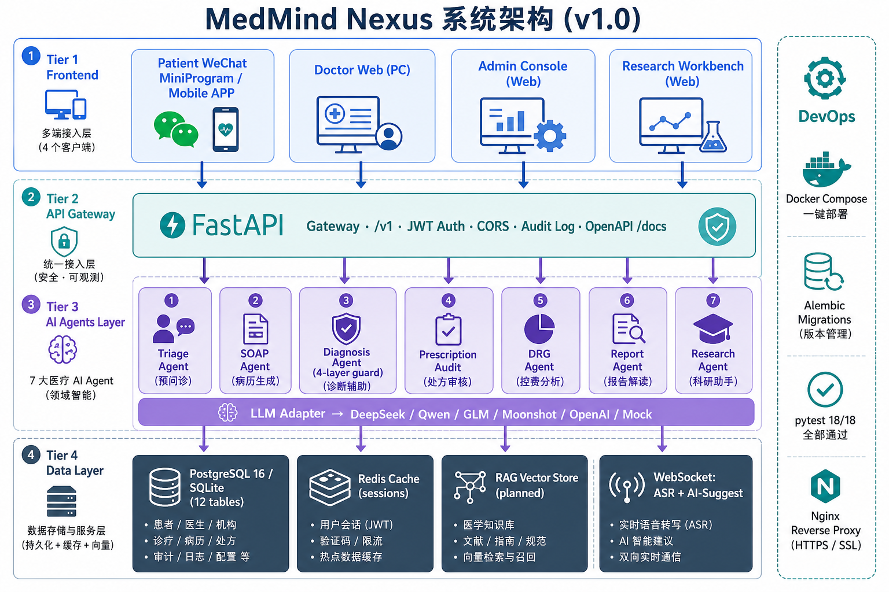

# MedMind Nexus · 系统架构说明

> v1.0 · 全栈生产级架构 · 配套 PRD §M5/M6

## 一图看懂架构



---

## 四层架构总览

### Tier 1 · 多端接入层 (Frontend)

| 客户端 | 形态 | 技术 | 入口 |
|---|---|---|---|
| 患者端 | 微信小程序 / 手机 APP / H5 | 响应式 HTML5 | `patient/index.html` |
| 医生端 | PC 桌面端 / Web | HTML5 + Chart.js | `doctor/workbench.html` |
| 管理端 | Web 浏览器 | HTML5 + Chart.js (深色主题) | `admin/dashboard.html` |
| 科研端 | Web 浏览器 | HTML5 + Chart.js | `research/literature.html` |

所有前端通过 **公共 API 客户端** (`assets/js/api.js`, 226 行) 统一接入后端;后端不可用时**自动回退** 本地 demo 数据,**永不报错白屏**。

### Tier 2 · API 网关 (FastAPI)

- **FastAPI 0.115** + Uvicorn ASGI
- 统一 `/v1` 前缀
- **JWT (HS256)** + bcrypt 双 token 认证
- **CORS** 可配置白名单
- **审计日志** 拦截器: 所有写操作记录 user/IP/UA/action/result
- **OpenAPI 3.0** 自动生成: `/docs` Swagger + `/redoc` ReDoc
- **标准响应包络** `{code, message, data}` + 全局异常处理

### Tier 3 · AI Agent 层

#### 7 大医疗 Agent

| # | Agent | 端点 | 核心能力 |
|---|---|---|---|
| 1 | **预问诊** Triage | `/v1/triage/*` | 多轮问诊 → 自动 SOAP 摘要 |
| 2 | **SOAP 病历** | `/v1/records/ai-draft` | 主诉转完整 S/O/A/P + ICD-10 |
| 3 | **诊断辅助** Diagnosis | `/v1/reports/diagnose` | 主诊+鉴别+循证,**4 层幻觉防护** |
| 4 | **处方审核** Audit | `/v1/prescriptions/audit` | 双抗/相互作用/剂量/禁忌 |
| 5 | **DRG 控费** | `/v1/drg/predict` | DRG 分组+盈亏+优化建议 |
| 6 | **报告解读** Report | `/v1/reports/interpret` | 检验/影像通俗解读 |
| 7 | **科研** Research | `/v1/research/*` | 文献/标书/统计/润色 |

#### 4 层幻觉防护 (Diagnosis Agent)

```
Layer 1: Prompt 约束     → 禁止编造 ICD/药品
Layer 2: 输出 JSON Schema → Pydantic 严格校验
Layer 3: 引用回溯        → 每条结论必须 citation
Layer 4: 置信度阈值      → <0.6 标记 "需医生复核"
```

#### LLM 适配器 (`services/llm/`)

OpenAI 兼容协议,**一行环境变量切换**:

```bash
LLM_PROVIDER=mock      # 离线 Mock (默认, 零成本演示)
LLM_PROVIDER=deepseek  # DeepSeek-R1 Medical
LLM_PROVIDER=qwen      # 通义千问 Max
LLM_PROVIDER=zhipu     # 智谱 GLM-4
LLM_PROVIDER=moonshot  # Moonshot Kimi
LLM_PROVIDER=openai    # OpenAI GPT
```

### Tier 4 · 数据存储层

| 组件 | 用途 | 替换性 |
|---|---|---|
| PostgreSQL 16 / SQLite | 主库 **(15 张表，v3.6 新增 `notifications`)** | `DATABASE_URL` 一行切换 |
| Redis (规划) | 会话/限流缓存 | docker-compose 已预留 |
| RAG Vector Store (规划) | Milvus / Chroma | LLM 适配器层预留 hook |
| 文件存储 (规划) | MinIO / 对象存储 | OSS 兼容接口预留 |

#### 15 张表 (SQLAlchemy 2.0 async ORM，v3.6 新增 `notifications`)

```
users · patients · doctors · departments
medical_records · prescriptions · prescription_items
appointments · ai_conversations · ai_messages
drg_cases · lab_reports · audit_logs
notifications                      ← v3.6 新增
```

Alembic 迁移配置完整,生产 PostgreSQL 切换零代码改动。

---

## 横切关注点

### WebSocket 实时层

- `WS /v1/ws/asr` · `WS /v1/ws/asr/stream`（v3.6 PRD §9.1 字面路径）: 实时语音转写 (PCM 16k → partial/final JSON)
- `WS /v1/ws/ai-suggest` · `WS /v1/ws/ai/suggestions`（v3.6 PRD §9.2 字面路径）: AI 诊断建议推送

### 安全

- JWT HS256, access 60min + refresh 7day
- bcrypt 密码哈希 (rounds=12)
- 5 角色 RBAC: patient / doctor / pharmacist / admin / researcher
- 等保三级审计 (audit_logs 表): user_id / action / result / IP / UA

### 可观测

- loguru 结构化日志
- `/health` 健康检查 (含数据库探活)
- SQL Echo 可开关 (`SQL_ECHO=true`)

### 部署

- Dockerfile (python:3.11-slim, 健康检查)
- docker-compose.yml (3 profile: 默认 / prod=PG+Redis / nginx 反代)
- 前端 `/web` 同源挂载
- HTTPS/SSL 通过 Nginx 反代实现

---

## 数据流示例 · 医生诊间 SOAP 生成

```
1. 医生在 doctor/consultation.html 录音/输入主诉
   ↓
2. 前端 api.js → POST /v1/records/ai-draft (Bearer JWT)
   ↓
3. FastAPI 网关: 鉴权 → 审计 → 路由
   ↓
4. SOAP Agent: 组装 Prompt → LLM 适配器 → Mock/DeepSeek
   ↓
5. 输出 Pydantic 校验 → 注入 ICD-10 → 引用回溯
   ↓
6. 返回 { subjective, objective, assessment, plan, icd10, confidence, citations }
   ↓
7. 前端渲染 SOAP 4 卡片 + 医生审核 + 一键保存
   ↓
8. POST /v1/records/ 持久化 → audit_logs 留痕
```

---

## 质量保证

| 维度 | 指标 |
|---|---|
| 单元测试 | **53 个 pytest 用例, 100% 通过（v3.6.2 复测）** |
| 代码量 | 后端 3682 行 + 前端 3261 行 = **6943 行** |
| API 覆盖 | 40+ REST 路由 + 2 WebSocket |
| 文档 | OpenAPI 自动生成 + 6 份原始 PRD |
| 部署 | Docker / Docker Compose 一键 |
| 警告 | **0** (deprecated 全部清零) |

---

## 路线图 (生产化)

- [ ] DeepSeek-R1 Medical 真模型对接 (.env 一行配置)
- [ ] PostgreSQL 16 + TimescaleDB (DATABASE_URL 切换)
- [ ] Milvus 向量库 + 真 RAG 流水线
- [ ] Whisper / Azure Speech 替换 ASR 演示
- [ ] HIS/LIS/PACS 院内系统集成
- [ ] Kubernetes 生产部署 (按 PRD §10)
- [ ] 等保三级合规改造 (RLS + WAL + 数据加密)
